# UML Diagrams and Design Documentation - CraftTraining

This document contains comprehensive UML diagrams, class diagrams, sequence diagrams, High-Level Design (HLD), Low-Level Design (LLD), CRAFT model architecture, and visual representations of the project structure and interconnections.

## Table of Contents

- [High-Level Design (HLD)](#high-level-design-hld)
- [Low-Level Design (LLD)](#low-level-design-lld)
- [Class Diagrams](#class-diagrams)
- [CRAFT Model Architecture](#craft-model-architecture)
- [Sequence Diagrams](#sequence-diagrams)
- [Folder and File Structure](#folder-and-file-structure)
- [Module Interconnections](#module-interconnections)
- [Data Flow Diagrams](#data-flow-diagrams)

---

## High-Level Design (HLD)

### System Overview

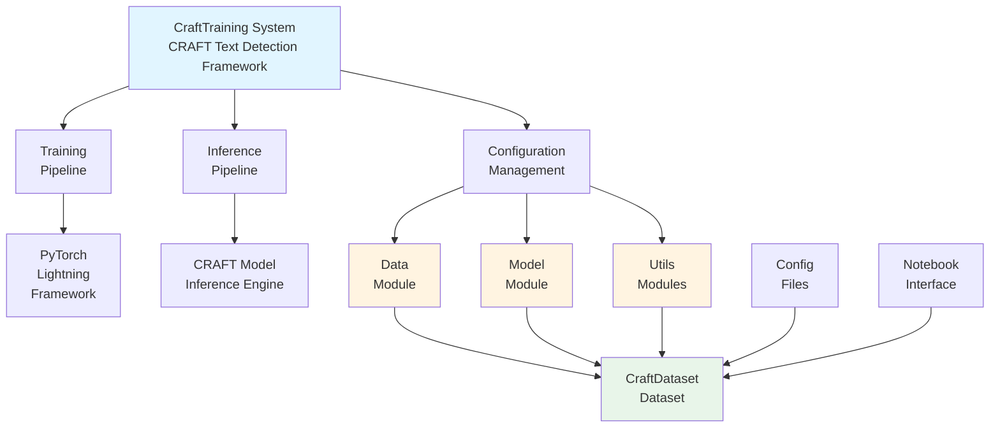
```mermaid
flowchart TD
    System["CraftTraining System<br/>CRAFT Text Detection Framework"]
    
    Config["Configuration<br/>Management"]
    Training["Training<br/>Pipeline"]
    Inference["Inference<br/>Pipeline"]
    
    PyTorchLightning["PyTorch<br/>Lightning<br/>Framework"]
    ModelEngine["CRAFT Model<br/>Inference Engine"]
    
    DataModule["Data<br/>Module"]
    ModelModule["Model<br/>Module"]
    UtilsModule["Utils<br/>Modules"]
    
    CraftDataset["CraftDataset<br/>Dataset"]
    ConfigFiles["Config<br/>Files"]
    Notebook["Notebook<br/>Interface"]
    
    System --> Config
    System --> Training
    System --> Inference
    
    Training --> PyTorchLightning
    Inference --> ModelEngine
    
    Config --> DataModule
    Config --> ModelModule
    Config --> UtilsModule
    
    DataModule --> CraftDataset
    ModelModule --> CraftDataset
    UtilsModule --> CraftDataset
    
    ConfigFiles --> CraftDataset
    Notebook --> CraftDataset
    
    style System fill:#e1f5ff
    style DataModule fill:#fff4e1
    style ModelModule fill:#fff4e1
    style UtilsModule fill:#fff4e1
    style CraftDataset fill:#e8f5e9
```

### Component Architecture

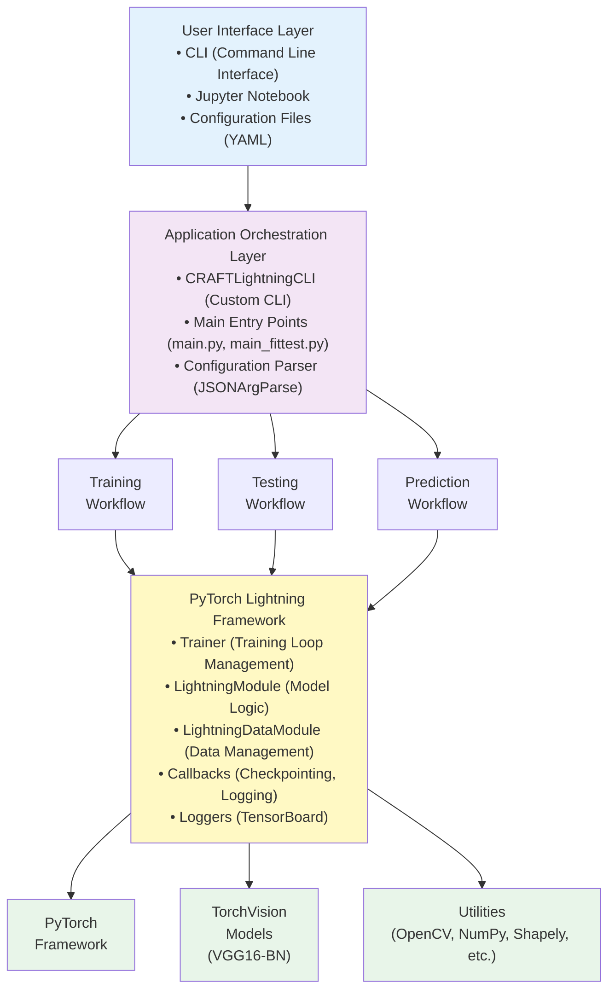
```mermaid
flowchart TD
    UILayer["User Interface Layer<br/>• CLI (Command Line Interface)<br/>• Jupyter Notebook<br/>• Configuration Files (YAML)"]
    
    OrchestrationLayer["Application Orchestration Layer<br/>• CRAFTLightningCLI (Custom CLI)<br/>• Main Entry Points (main.py, main_fittest.py)<br/>• Configuration Parser (JSONArgParse)"]
    
    TrainingWorkflow["Training<br/>Workflow"]
    TestingWorkflow["Testing<br/>Workflow"]
    PredictionWorkflow["Prediction<br/>Workflow"]
    
    LightningFramework["PyTorch Lightning Framework<br/>• Trainer (Training Loop Management)<br/>• LightningModule (Model Logic)<br/>• LightningDataModule (Data Management)<br/>• Callbacks (Checkpointing, Logging)<br/>• Loggers (TensorBoard)"]
    
    PyTorch["PyTorch<br/>Framework"]
    TorchVision["TorchVision<br/>Models<br/>(VGG16-BN)"]
    Utilities["Utilities<br/>(OpenCV, NumPy, Shapely, etc.)"]
    
    UILayer --> OrchestrationLayer
    OrchestrationLayer --> TrainingWorkflow
    OrchestrationLayer --> TestingWorkflow
    OrchestrationLayer --> PredictionWorkflow
    
    TrainingWorkflow --> LightningFramework
    TestingWorkflow --> LightningFramework
    PredictionWorkflow --> LightningFramework
    
    LightningFramework --> PyTorch
    LightningFramework --> TorchVision
    LightningFramework --> Utilities
    
    style UILayer fill:#e3f2fd
    style OrchestrationLayer fill:#f3e5f5
    style LightningFramework fill:#fff9c4
    style PyTorch fill:#e8f5e9
    style TorchVision fill:#e8f5e9
    style Utilities fill:#e8f5e9
```

### Data Flow Architecture

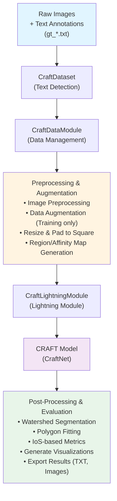
```mermaid
flowchart TD
    RawData["Raw Images<br/>+ Text Annotations<br/>(gt_*.txt)"]
    
    CraftDataset["CraftDataset<br/>(Text Detection)"]
    CraftDataModule["CraftDataModule<br/>(Data Management)"]
    
    Preprocessing["Preprocessing & Augmentation<br/>• Image Preprocessing<br/>• Data Augmentation (Training only)<br/>• Resize & Pad to Square<br/>• Region/Affinity Map Generation"]
    
    ModelModule["CraftLightningModule<br/>(Lightning Module)"]
    CraftNet["CRAFT Model<br/>(CraftNet)"]
    
    PostProcessing["Post-Processing & Evaluation<br/>• Watershed Segmentation<br/>• Polygon Fitting<br/>• IoS-based Metrics<br/>• Generate Visualizations<br/>• Export Results (TXT, Images)"]
    
    RawData --> CraftDataset
    CraftDataset --> CraftDataModule
    CraftDataModule --> Preprocessing
    Preprocessing --> ModelModule
    ModelModule --> CraftNet
    CraftNet --> PostProcessing
    
    style RawData fill:#e1f5ff
    style Preprocessing fill:#fff4e1
    style CraftNet fill:#f3e5f5
    style PostProcessing fill:#e8f5e9
```

---

## Low-Level Design (LLD)

### Module Dependencies

```
CraftTraining/
├── cli.py
│   └── depends on: lightning.pytorch.cli
│
├── main.py
│   └── depends on: cli.py
│
├── main_fittest.py
│   └── depends on: cli.py
│
├── datamodule.py
│   ├── depends on: lightning, CraftTraining.dataset, utils.craftImageaugmentation
│   └── exports: CraftDataModule
│
├── dataset.py
│   ├── depends on: torch.utils.data, cv2, numpy, utils.craftImageaugmentation, utils.craftTarget
│   └── exports: CraftDataset
│
├── module.py
│   ├── depends on: lightning, cv2, torch, utils.craftImagevisualization, utils.craftmetrics, utils.craft_postprocess
│   └── exports: CraftLightningModule
│
└── model.py
    ├── depends on: torch, torchvision
    └── exports: CraftNet

utils/ (CRAFT-specific)
├── craftTarget.py
│   └── exports: generate_region_affinity_maps
│
├── craftmetrics.py
│   └── exports: CraftMetrics
│
├── craft_postprocess.py
│   └── exports: craft_watershed
│
├── craftImageaugmentation.py
│   └── exports: get_transform
│
└── craftImagevisualization.py
    └── exports: visualizeOneBatchImages, drawCV2BBWithText
```

---

## Class Diagrams

### Core Classes Diagram

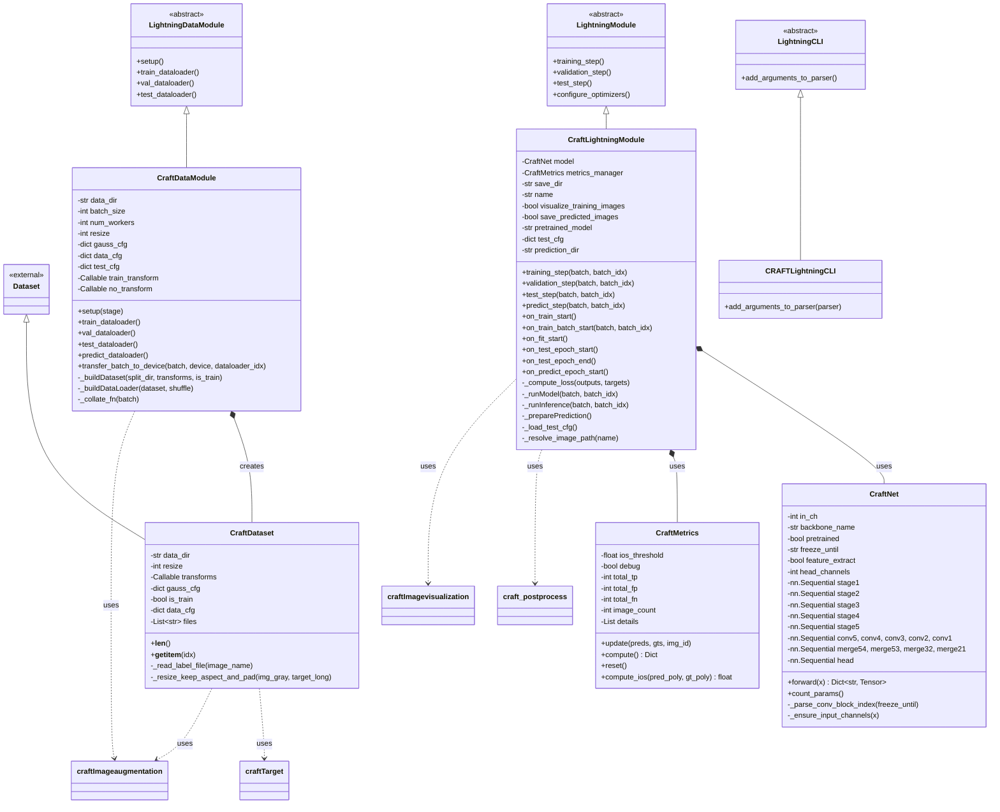
```mermaid
classDiagram
    class LightningModule {
        <<abstract>>
        +training_step()
        +validation_step()
        +test_step()
        +configure_optimizers()
    }
    
    class LightningDataModule {
        <<abstract>>
        +setup()
        +train_dataloader()
        +val_dataloader()
        +test_dataloader()
    }
    
    class LightningCLI {
        <<abstract>>
        +add_arguments_to_parser()
    }
    
    class Dataset {
        <<external>>
    }
    
    class CraftLightningModule {
        -CraftNet model
        -CraftMetrics metrics_manager
        -str save_dir
        -str name
        -bool visualize_training_images
        -bool save_predicted_images
        -str pretrained_model
        -dict test_cfg
        -str prediction_dir
        +training_step(batch, batch_idx)
        +validation_step(batch, batch_idx)
        +test_step(batch, batch_idx)
        +predict_step(batch, batch_idx)
        +on_train_start()
        +on_train_batch_start(batch, batch_idx)
        +on_fit_start()
        +on_test_epoch_start()
        +on_test_epoch_end()
        +on_predict_epoch_start()
        -_compute_loss(outputs, targets)
        -_runModel(batch, batch_idx)
        -_runInference(batch, batch_idx)
        -_preparePrediction()
        -_load_test_cfg()
        -_resolve_image_path(name)
    }
    
    class CraftDataModule {
        -str data_dir
        -int batch_size
        -int num_workers
        -int resize
        -dict gauss_cfg
        -dict data_cfg
        -dict test_cfg
        -Callable train_transform
        -Callable no_transform
        +setup(stage)
        +train_dataloader()
        +val_dataloader()
        +test_dataloader()
        +predict_dataloader()
        +transfer_batch_to_device(batch, device, dataloader_idx)
        -_buildDataset(split_dir, transforms, is_train)
        -_buildDataLoader(dataset, shuffle)
        -_collate_fn(batch)
    }
    
    class CraftDataset {
        -str data_dir
        -int resize
        -Callable transforms
        -dict gauss_cfg
        -bool is_train
        -dict data_cfg
        -List~str~ files
        +__len__()
        +__getitem__(idx)
        -_read_label_file(image_name)
        -_resize_keep_aspect_and_pad(img_gray, target_long)
    }
    
    class CRAFTLightningCLI {
        +add_arguments_to_parser(parser)
    }
    
    class CraftNet {
        -int in_ch
        -str backbone_name
        -bool pretrained
        -str freeze_until
        -bool feature_extract
        -int head_channels
        -nn.Sequential stage1
        -nn.Sequential stage2
        -nn.Sequential stage3
        -nn.Sequential stage4
        -nn.Sequential stage5
        -nn.Sequential conv5, conv4, conv3, conv2, conv1
        -nn.Sequential merge54, merge53, merge32, merge21
        -nn.Sequential head
        +forward(x) Dict~str, Tensor~
        +count_params()
        -_parse_conv_block_index(freeze_until)
        -_ensure_input_channels(x)
    }
    
    class CraftMetrics {
        -float ios_threshold
        -bool debug
        -int total_tp
        -int total_fp
        -int total_fn
        -int image_count
        -List details
        +update(preds, gts, img_id)
        +compute() Dict
        +reset()
        +compute_ios(pred_poly, gt_poly) float
    }
    
    %% Inheritance
    LightningModule <|-- CraftLightningModule
    LightningDataModule <|-- CraftDataModule
    LightningCLI <|-- CRAFTLightningCLI
    Dataset <|-- CraftDataset
    
    %% Composition
    CraftLightningModule *-- CraftNet : uses
    CraftLightningModule *-- CraftMetrics : uses
    CraftDataModule *-- CraftDataset : creates
    
    %% Dependencies
    CraftLightningModule ..> craft_postprocess : uses
    CraftLightningModule ..> craftImagevisualization : uses
    CraftDataModule ..> craftImageaugmentation : uses
    CraftDataset ..> craftTarget : uses
    CraftDataset ..> craftImageaugmentation : uses
```

### Detailed CraftLightningModule Class

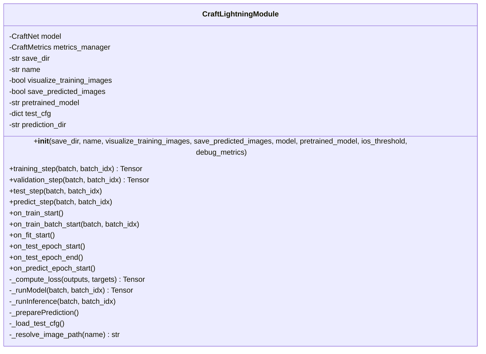
```mermaid
classDiagram
    class CraftLightningModule {
        -CraftNet model
        -CraftMetrics metrics_manager
        -str save_dir
        -str name
        -bool visualize_training_images
        -bool save_predicted_images
        -str pretrained_model
        -dict test_cfg
        -str prediction_dir
        +__init__(save_dir, name, visualize_training_images, save_predicted_images, model, pretrained_model, ios_threshold, debug_metrics)
        +training_step(batch, batch_idx) Tensor
        +validation_step(batch, batch_idx) Tensor
        +test_step(batch, batch_idx)
        +predict_step(batch, batch_idx)
        +on_train_start()
        +on_train_batch_start(batch, batch_idx)
        +on_fit_start()
        +on_test_epoch_start()
        +on_test_epoch_end()
        +on_predict_epoch_start()
        -_compute_loss(outputs, targets) Tensor
        -_runModel(batch, batch_idx) Tensor
        -_runInference(batch, batch_idx)
        -_preparePrediction()
        -_load_test_cfg()
        -_resolve_image_path(name) str
    }
```

### Detailed CraftDataModule Class

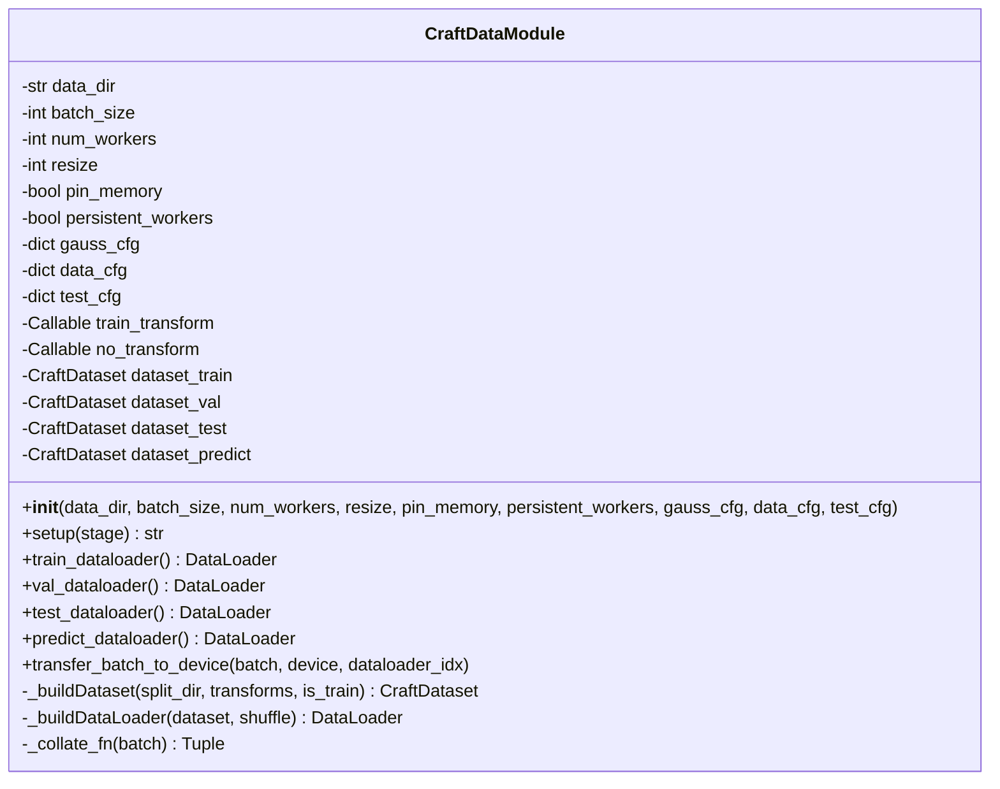
```mermaid
classDiagram
    class CraftDataModule {
        -str data_dir
        -int batch_size
        -int num_workers
        -int resize
        -bool pin_memory
        -bool persistent_workers
        -dict gauss_cfg
        -dict data_cfg
        -dict test_cfg
        -Callable train_transform
        -Callable no_transform
        -CraftDataset dataset_train
        -CraftDataset dataset_val
        -CraftDataset dataset_test
        -CraftDataset dataset_predict
        +__init__(data_dir, batch_size, num_workers, resize, pin_memory, persistent_workers, gauss_cfg, data_cfg, test_cfg)
        +setup(stage) str
        +train_dataloader() DataLoader
        +val_dataloader() DataLoader
        +test_dataloader() DataLoader
        +predict_dataloader() DataLoader
        +transfer_batch_to_device(batch, device, dataloader_idx)
        -_buildDataset(split_dir, transforms, is_train) CraftDataset
        -_buildDataLoader(dataset, shuffle) DataLoader
        -_collate_fn(batch) Tuple
    }
```

### Detailed CraftNet Class

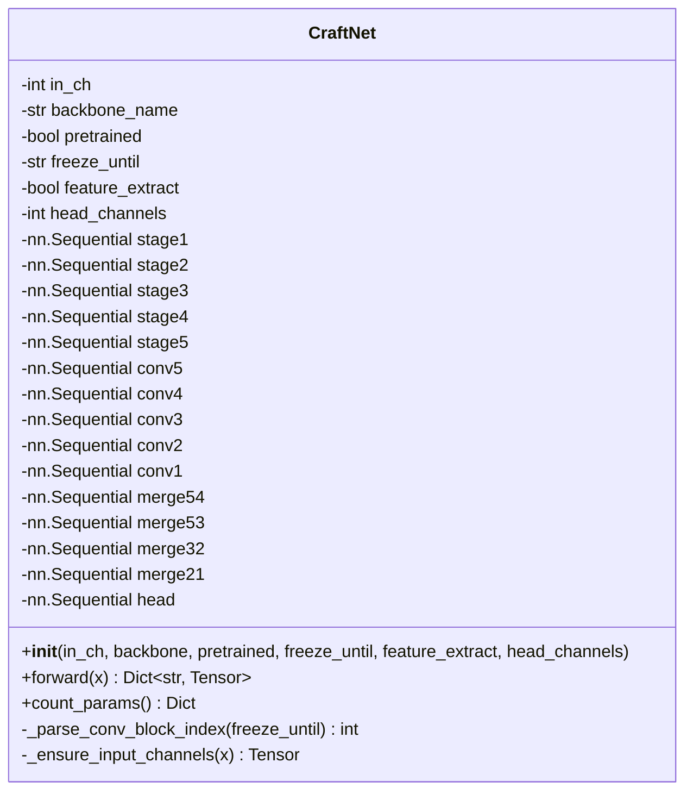
```mermaid
classDiagram
    class CraftNet {
        -int in_ch
        -str backbone_name
        -bool pretrained
        -str freeze_until
        -bool feature_extract
        -int head_channels
        -nn.Sequential stage1
        -nn.Sequential stage2
        -nn.Sequential stage3
        -nn.Sequential stage4
        -nn.Sequential stage5
        -nn.Sequential conv5
        -nn.Sequential conv4
        -nn.Sequential conv3
        -nn.Sequential conv2
        -nn.Sequential conv1
        -nn.Sequential merge54
        -nn.Sequential merge53
        -nn.Sequential merge32
        -nn.Sequential merge21
        -nn.Sequential head
        +__init__(in_ch, backbone, pretrained, freeze_until, feature_extract, head_channels)
        +forward(x) Dict~str, Tensor~
        +count_params() Dict
        -_parse_conv_block_index(freeze_until) int
        -_ensure_input_channels(x) Tensor
    }
```

---

## CRAFT Model Architecture

### Model Architecture Overview

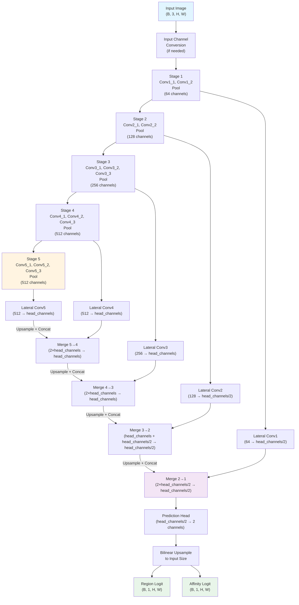
```mermaid
flowchart TD
    Input["Input Image<br/>(B, 3, H, W)"]
    
    InputConv["Input Channel<br/>Conversion<br/>(if needed)"]
    
    Stage1["Stage 1<br/>Conv1_1, Conv1_2<br/>Pool<br/>(64 channels)"]
    Stage2["Stage 2<br/>Conv2_1, Conv2_2<br/>Pool<br/>(128 channels)"]
    Stage3["Stage 3<br/>Conv3_1, Conv3_2, Conv3_3<br/>Pool<br/>(256 channels)"]
    Stage4["Stage 4<br/>Conv4_1, Conv4_2, Conv4_3<br/>Pool<br/>(512 channels)"]
    Stage5["Stage 5<br/>Conv5_1, Conv5_2, Conv5_3<br/>Pool<br/>(512 channels)"]
    
    Conv5["Lateral Conv5<br/>(512 → head_channels)"]
    Conv4["Lateral Conv4<br/>(512 → head_channels)"]
    Conv3["Lateral Conv3<br/>(256 → head_channels)"]
    Conv2["Lateral Conv2<br/>(128 → head_channels/2)"]
    Conv1["Lateral Conv1<br/>(64 → head_channels/2)"]
    
    Merge54["Merge 5→4<br/>(2×head_channels → head_channels)"]
    Merge43["Merge 4→3<br/>(2×head_channels → head_channels)"]
    Merge32["Merge 3→2<br/>(head_channels + head_channels/2 → head_channels/2)"]
    Merge21["Merge 2→1<br/>(2×head_channels/2 → head_channels/2)"]
    
    Head["Prediction Head<br/>(head_channels/2 → 2 channels)"]
    
    Upsample["Bilinear Upsample<br/>to Input Size"]
    
    RegionLogit["Region Logit<br/>(B, 1, H, W)"]
    AffinityLogit["Affinity Logit<br/>(B, 1, H, W)"]
    
    Input --> InputConv
    InputConv --> Stage1
    Stage1 --> Stage2
    Stage2 --> Stage3
    Stage3 --> Stage4
    Stage4 --> Stage5
    
    Stage5 --> Conv5
    Stage4 --> Conv4
    Stage3 --> Conv3
    Stage2 --> Conv2
    Stage1 --> Conv1
    
    Conv5 -->|Upsample + Concat| Merge54
    Conv4 --> Merge54
    Merge54 -->|Upsample + Concat| Merge43
    Conv3 --> Merge43
    Merge43 -->|Upsample + Concat| Merge32
    Conv2 --> Merge32
    Merge32 -->|Upsample + Concat| Merge21
    Conv1 --> Merge21
    
    Merge21 --> Head
    Head --> Upsample
    Upsample --> RegionLogit
    Upsample --> AffinityLogit
    
    style Input fill:#e1f5ff
    style Stage5 fill:#fff4e1
    style Merge21 fill:#f3e5f5
    style RegionLogit fill:#e8f5e9
    style AffinityLogit fill:#e8f5e9
```

### Feature Fusion Flow

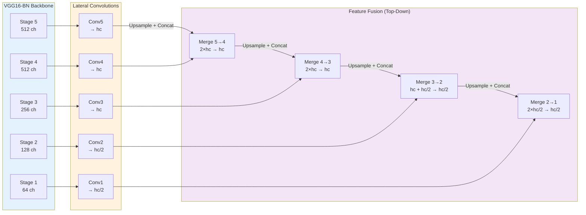
```mermaid
flowchart LR
    subgraph Backbone["VGG16-BN Backbone"]
        S1["Stage 1<br/>64 ch"]
        S2["Stage 2<br/>128 ch"]
        S3["Stage 3<br/>256 ch"]
        S4["Stage 4<br/>512 ch"]
        S5["Stage 5<br/>512 ch"]
    end
    
    subgraph Lateral["Lateral Convolutions"]
        L5["Conv5<br/>→ hc"]
        L4["Conv4<br/>→ hc"]
        L3["Conv3<br/>→ hc"]
        L2["Conv2<br/>→ hc/2"]
        L1["Conv1<br/>→ hc/2"]
    end
    
    subgraph Fusion["Feature Fusion (Top-Down)"]
        M54["Merge 5→4<br/>2×hc → hc"]
        M43["Merge 4→3<br/>2×hc → hc"]
        M32["Merge 3→2<br/>hc + hc/2 → hc/2"]
        M21["Merge 2→1<br/>2×hc/2 → hc/2"]
    end
    
    S1 --> L1
    S2 --> L2
    S3 --> L3
    S4 --> L4
    S5 --> L5
    
    L5 -->|Upsample + Concat| M54
    L4 --> M54
    M54 -->|Upsample + Concat| M43
    L3 --> M43
    M43 -->|Upsample + Concat| M32
    L2 --> M32
    M32 -->|Upsample + Concat| M21
    L1 --> M21
    
    style Backbone fill:#e3f2fd
    style Lateral fill:#fff3e0
    style Fusion fill:#f3e5f5
```

### Model Processing Pipeline

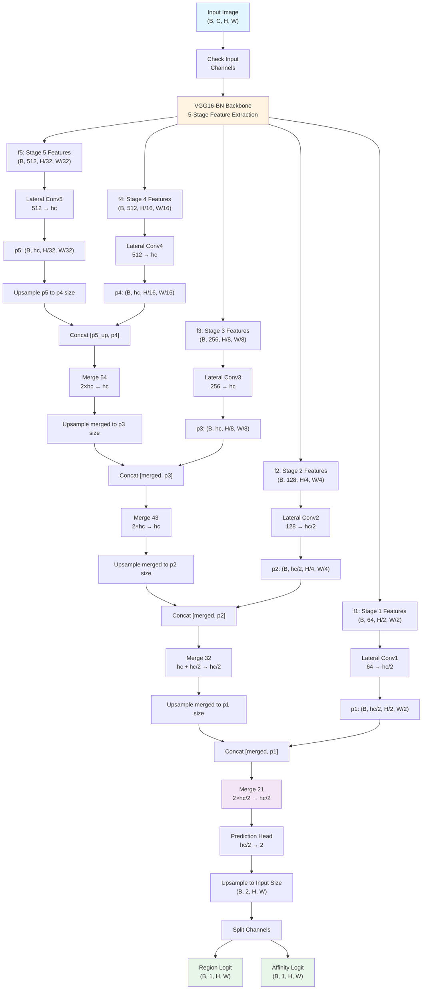
```mermaid
flowchart TD
    InputImage["Input Image<br/>(B, C, H, W)"]
    
    CheckChannels["Check Input<br/>Channels"]
    
    Backbone["VGG16-BN Backbone<br/>5-Stage Feature Extraction"]
    
    F1["f1: Stage 1 Features<br/>(B, 64, H/2, W/2)"]
    F2["f2: Stage 2 Features<br/>(B, 128, H/4, W/4)"]
    F3["f3: Stage 3 Features<br/>(B, 256, H/8, W/8)"]
    F4["f4: Stage 4 Features<br/>(B, 512, H/16, W/16)"]
    F5["f5: Stage 5 Features<br/>(B, 512, H/32, W/32)"]
    
    Lateral5["Lateral Conv5<br/>512 → hc"]
    Lateral4["Lateral Conv4<br/>512 → hc"]
    Lateral3["Lateral Conv3<br/>256 → hc"]
    Lateral2["Lateral Conv2<br/>128 → hc/2"]
    Lateral1["Lateral Conv1<br/>64 → hc/2"]
    
    P5["p5: (B, hc, H/32, W/32)"]
    P4["p4: (B, hc, H/16, W/16)"]
    P3["p3: (B, hc, H/8, W/8)"]
    P2["p2: (B, hc/2, H/4, W/4)"]
    P1["p1: (B, hc/2, H/2, W/2)"]
    
    Upsample54["Upsample p5 to p4 size"]
    Concat54["Concat [p5_up, p4]"]
    Merge54["Merge 54<br/>2×hc → hc"]
    
    Upsample43["Upsample merged to p3 size"]
    Concat43["Concat [merged, p3]"]
    Merge43["Merge 43<br/>2×hc → hc"]
    
    Upsample32["Upsample merged to p2 size"]
    Concat32["Concat [merged, p2]"]
    Merge32["Merge 32<br/>hc + hc/2 → hc/2"]
    
    Upsample21["Upsample merged to p1 size"]
    Concat21["Concat [merged, p1]"]
    Merge21["Merge 21<br/>2×hc/2 → hc/2"]
    
    Head["Prediction Head<br/>hc/2 → 2"]
    
    UpsampleFinal["Upsample to Input Size<br/>(B, 2, H, W)"]
    
    Split["Split Channels"]
    
    RegionLogit["Region Logit<br/>(B, 1, H, W)"]
    AffinityLogit["Affinity Logit<br/>(B, 1, H, W)"]
    
    InputImage --> CheckChannels
    CheckChannels --> Backbone
    
    Backbone --> F1
    Backbone --> F2
    Backbone --> F3
    Backbone --> F4
    Backbone --> F5
    
    F1 --> Lateral1 --> P1
    F2 --> Lateral2 --> P2
    F3 --> Lateral3 --> P3
    F4 --> Lateral4 --> P4
    F5 --> Lateral5 --> P5
    
    P5 --> Upsample54 --> Concat54
    P4 --> Concat54
    Concat54 --> Merge54
    
    Merge54 --> Upsample43 --> Concat43
    P3 --> Concat43
    Concat43 --> Merge43
    
    Merge43 --> Upsample32 --> Concat32
    P2 --> Concat32
    Concat32 --> Merge32
    
    Merge32 --> Upsample21 --> Concat21
    P1 --> Concat21
    Concat21 --> Merge21
    
    Merge21 --> Head
    Head --> UpsampleFinal
    UpsampleFinal --> Split
    Split --> RegionLogit
    Split --> AffinityLogit
    
    style InputImage fill:#e1f5ff
    style Backbone fill:#fff4e1
    style Merge21 fill:#f3e5f5
    style RegionLogit fill:#e8f5e9
    style AffinityLogit fill:#e8f5e9
```

### Backbone Stages Detail

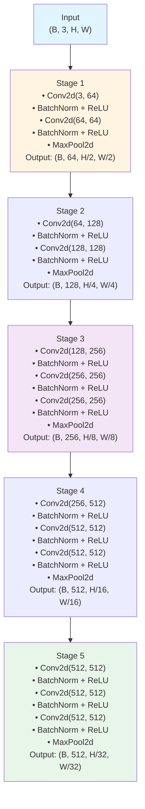
```mermaid
flowchart TD
    Input["Input<br/>(B, 3, H, W)"]
    
    Stage1["Stage 1<br/>• Conv2d(3, 64)<br/>• BatchNorm + ReLU<br/>• Conv2d(64, 64)<br/>• BatchNorm + ReLU<br/>• MaxPool2d<br/>Output: (B, 64, H/2, W/2)"]
    
    Stage2["Stage 2<br/>• Conv2d(64, 128)<br/>• BatchNorm + ReLU<br/>• Conv2d(128, 128)<br/>• BatchNorm + ReLU<br/>• MaxPool2d<br/>Output: (B, 128, H/4, W/4)"]
    
    Stage3["Stage 3<br/>• Conv2d(128, 256)<br/>• BatchNorm + ReLU<br/>• Conv2d(256, 256)<br/>• BatchNorm + ReLU<br/>• Conv2d(256, 256)<br/>• BatchNorm + ReLU<br/>• MaxPool2d<br/>Output: (B, 256, H/8, W/8)"]
    
    Stage4["Stage 4<br/>• Conv2d(256, 512)<br/>• BatchNorm + ReLU<br/>• Conv2d(512, 512)<br/>• BatchNorm + ReLU<br/>• Conv2d(512, 512)<br/>• BatchNorm + ReLU<br/>• MaxPool2d<br/>Output: (B, 512, H/16, W/16)"]
    
    Stage5["Stage 5<br/>• Conv2d(512, 512)<br/>• BatchNorm + ReLU<br/>• Conv2d(512, 512)<br/>• BatchNorm + ReLU<br/>• Conv2d(512, 512)<br/>• BatchNorm + ReLU<br/>• MaxPool2d<br/>Output: (B, 512, H/32, W/32)"]
    
    Input --> Stage1
    Stage1 --> Stage2
    Stage2 --> Stage3
    Stage3 --> Stage4
    Stage4 --> Stage5
    
    style Input fill:#e1f5ff
    style Stage1 fill:#fff4e1
    style Stage3 fill:#f3e5f5
    style Stage5 fill:#e8f5e9
```

---

## Sequence Diagrams

### Training Sequence Diagram

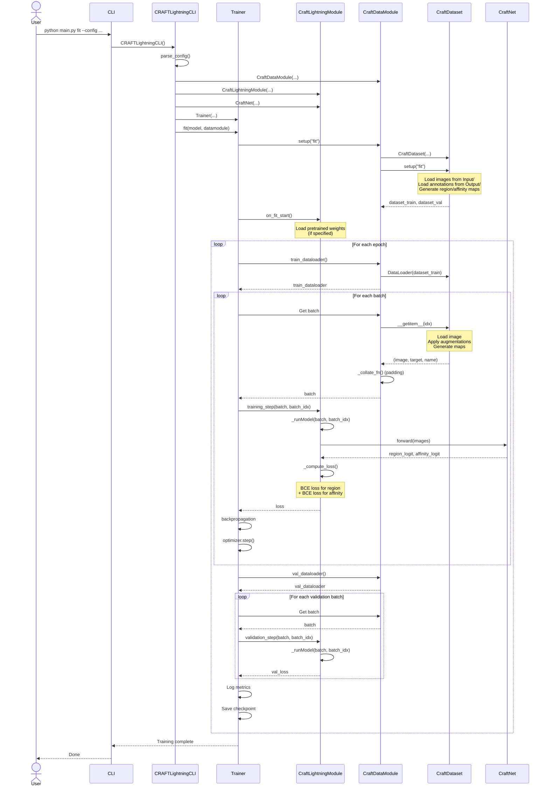
```mermaid
sequenceDiagram
    actor User
    participant CLI
    participant ODL as CRAFTLightningCLI
    participant Trainer
    participant Model as CraftLightningModule
    participant Data as CraftDataModule
    participant Dataset as CraftDataset
    participant CraftNet

    User->>CLI: python main.py fit --config ...
    CLI->>ODL: CRAFTLightningCLI()
    ODL->>ODL: parse_config()
    ODL->>Data: CraftDataModule(...)
    ODL->>Model: CraftLightningModule(...)
    ODL->>Model: CraftNet(...)
    ODL->>Trainer: Trainer(...)

    ODL->>Trainer: fit(model, datamodule)

    Trainer->>Data: setup("fit")
    Data->>Dataset: CraftDataset(...)
    Data->>Dataset: setup("fit")
    Note over Dataset: Load images from Input/<br/>Load annotations from Output/<br/>Generate region/affinity maps
    Dataset-->>Data: dataset_train, dataset_val

    Trainer->>Model: on_fit_start()
    Note over Model: Load pretrained weights<br/>(if specified)

    loop For each epoch
        Trainer->>Data: train_dataloader()
        Data->>Dataset: DataLoader(dataset_train)
        Data-->>Trainer: train_dataloader
        
        loop For each batch
            Trainer->>Data: Get batch
            Data->>Dataset: __getitem__(idx)
            Note over Dataset: Load image<br/>Apply augmentations<br/>Generate maps
            Dataset-->>Data: (image, target, name)
            Data->>Data: _collate_fn() (padding)
            Data-->>Trainer: batch
            
            Trainer->>Model: training_step(batch, batch_idx)
            Model->>Model: _runModel(batch, batch_idx)
            Model->>CraftNet: forward(images)
            CraftNet-->>Model: region_logit, affinity_logit
            Model->>Model: _compute_loss()
            Note over Model: BCE loss for region<br/>+ BCE loss for affinity
            Model-->>Trainer: loss
            Trainer->>Trainer: backpropagation
            Trainer->>Trainer: optimizer.step()
        end
        
        Trainer->>Data: val_dataloader()
        Data-->>Trainer: val_dataloader
        
        loop For each validation batch
            Trainer->>Data: Get batch
            Data-->>Trainer: batch
            Trainer->>Model: validation_step(batch, batch_idx)
            Model->>Model: _runModel(batch, batch_idx)
            Model-->>Trainer: val_loss
        end
        
        Trainer->>Trainer: Log metrics
        Trainer->>Trainer: Save checkpoint
    end

    Trainer-->>CLI: Training complete
    CLI-->>User: Done
```

### Testing Sequence Diagram

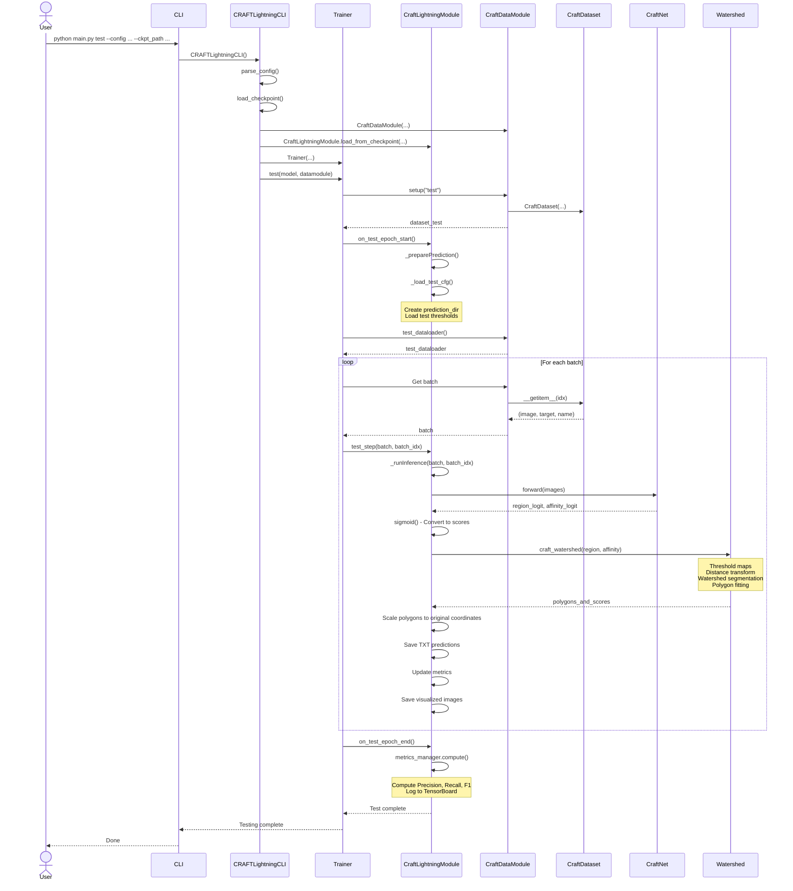
```mermaid
sequenceDiagram
    actor User
    participant CLI
    participant ODL as CRAFTLightningCLI
    participant Trainer
    participant Model as CraftLightningModule
    participant Data as CraftDataModule
    participant Dataset as CraftDataset
    participant CraftNet
    participant Watershed

    User->>CLI: python main.py test --config ... --ckpt_path ...
    CLI->>ODL: CRAFTLightningCLI()
    ODL->>ODL: parse_config()
    ODL->>ODL: load_checkpoint()
    ODL->>Data: CraftDataModule(...)
    ODL->>Model: CraftLightningModule.load_from_checkpoint(...)
    ODL->>Trainer: Trainer(...)

    ODL->>Trainer: test(model, datamodule)

    Trainer->>Data: setup("test")
    Data->>Dataset: CraftDataset(...)
    Data-->>Trainer: dataset_test

    Trainer->>Model: on_test_epoch_start()
    Model->>Model: _preparePrediction()
    Model->>Model: _load_test_cfg()
    Note over Model: Create prediction_dir<br/>Load test thresholds

    Trainer->>Data: test_dataloader()
    Data-->>Trainer: test_dataloader

    loop For each batch
        Trainer->>Data: Get batch
        Data->>Dataset: __getitem__(idx)
        Dataset-->>Data: (image, target, name)
        Data-->>Trainer: batch
        
        Trainer->>Model: test_step(batch, batch_idx)
        Model->>Model: _runInference(batch, batch_idx)
        Model->>CraftNet: forward(images)
        CraftNet-->>Model: region_logit, affinity_logit
        Model->>Model: sigmoid() - Convert to scores
        Model->>Watershed: craft_watershed(region, affinity)
        Note over Watershed: Threshold maps<br/>Distance transform<br/>Watershed segmentation<br/>Polygon fitting
        Watershed-->>Model: polygons_and_scores
        Model->>Model: Scale polygons to original coordinates
        Model->>Model: Save TXT predictions
        Model->>Model: Update metrics
        Model->>Model: Save visualized images
    end

    Trainer->>Model: on_test_epoch_end()
    Model->>Model: metrics_manager.compute()
    Note over Model: Compute Precision, Recall, F1<br/>Log to TensorBoard
    Model-->>Trainer: Test complete

    Trainer-->>CLI: Testing complete
    CLI-->>User: Done
```

### Prediction Sequence Diagram

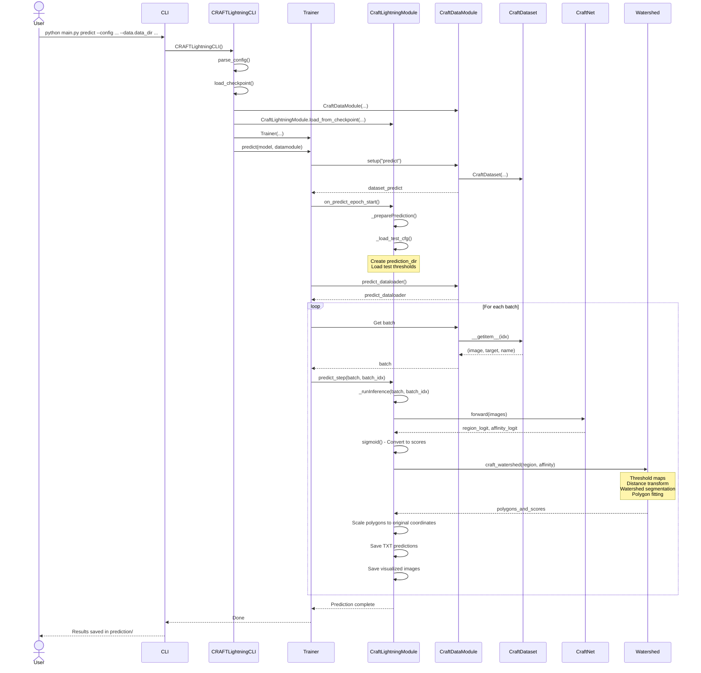
```mermaid
sequenceDiagram
    actor User
    participant CLI
    participant ODL as CRAFTLightningCLI
    participant Trainer
    participant Model as CraftLightningModule
    participant Data as CraftDataModule
    participant Dataset as CraftDataset
    participant CraftNet
    participant Watershed

    User->>CLI: python main.py predict --config ... --data.data_dir ...
    CLI->>ODL: CRAFTLightningCLI()
    ODL->>ODL: parse_config()
    ODL->>ODL: load_checkpoint()
    ODL->>Data: CraftDataModule(...)
    ODL->>Model: CraftLightningModule.load_from_checkpoint(...)
    ODL->>Trainer: Trainer(...)

    ODL->>Trainer: predict(model, datamodule)

    Trainer->>Data: setup("predict")
    Data->>Dataset: CraftDataset(...)
    Data-->>Trainer: dataset_predict

    Trainer->>Model: on_predict_epoch_start()
    Model->>Model: _preparePrediction()
    Model->>Model: _load_test_cfg()
    Note over Model: Create prediction_dir<br/>Load test thresholds

    Trainer->>Data: predict_dataloader()
    Data-->>Trainer: predict_dataloader

    loop For each batch
        Trainer->>Data: Get batch
        Data->>Dataset: __getitem__(idx)
        Dataset-->>Data: (image, target, name)
        Data-->>Trainer: batch
        
        Trainer->>Model: predict_step(batch, batch_idx)
        Model->>Model: _runInference(batch, batch_idx)
        Model->>CraftNet: forward(images)
        CraftNet-->>Model: region_logit, affinity_logit
        Model->>Model: sigmoid() - Convert to scores
        Model->>Watershed: craft_watershed(region, affinity)
        Note over Watershed: Threshold maps<br/>Distance transform<br/>Watershed segmentation<br/>Polygon fitting
        Watershed-->>Model: polygons_and_scores
        Model->>Model: Scale polygons to original coordinates
        Model->>Model: Save TXT predictions
        Model->>Model: Save visualized images
    end

    Model-->>Trainer: Prediction complete
    Trainer-->>CLI: Done
    CLI-->>User: Results saved in prediction/
```

---

## Folder and File Structure

### Complete Project Structure


```mermaid
graph TD
    Root["CraftTraining/"]
    
    Config["config/"]
    ConfigYAML["craft.yaml"]
    ConfigLocal["craft.local.yaml"]
    
    CLI["cli.py<br/>CRAFTLightningCLI"]
    Main["main.py<br/>CLI Entry Point"]
    MainFitTest["main_fittest.py<br/>Fit + Test"]
    DataModule["datamodule.py<br/>CraftDataModule"]
    Dataset["dataset.py<br/>CraftDataset"]
    Module["module.py<br/>CraftLightningModule"]
    Model["model.py<br/>CraftNet"]
    
    Utils["utils/ (CRAFT-specific)"]
    CraftTarget["craftTarget.py<br/>generate_region_affinity_maps"]
    CraftMetrics["craftmetrics.py<br/>CraftMetrics"]
    CraftPostProcess["craft_postprocess.py<br/>craft_watershed"]
    CraftImageAug["craftImageaugmentation.py<br/>get_transform"]
    CraftImageViz["craftImagevisualization.py<br/>visualization"]
    
    Notebook["CraftTrainer.ipynb"]
    Readme["README.md"]
    UML["UML_DIAGRAMS.md"]
    
    Root --> Config
    Root --> CLI
    Root --> Main
    Root --> MainFitTest
    Root --> DataModule
    Root --> Dataset
    Root --> Module
    Root --> Model
    Root --> Readme
    Root --> UML
    
    Config --> ConfigYAML
    Config --> ConfigLocal
    
    Utils --> CraftTarget
    Utils --> CraftMetrics
    Utils --> CraftPostProcess
    Utils --> CraftImageAug
    Utils --> CraftImageViz
    
    style Root fill:#e1f5ff
    style Model fill:#fff4e1
    style Module fill:#e8f5e9
    style Utils fill:#f3e5f5
```

### Dependency Graph

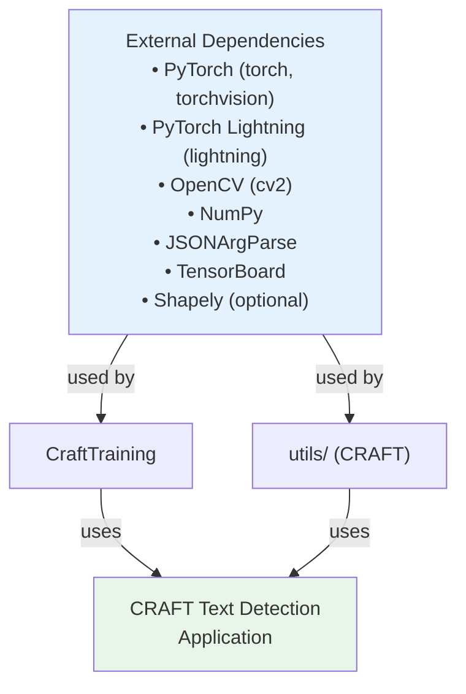
```mermaid
flowchart TD
    ExtDeps["External Dependencies<br/>• PyTorch (torch, torchvision)<br/>• PyTorch Lightning (lightning)<br/>• OpenCV (cv2)<br/>• NumPy<br/>• JSONArgParse<br/>• TensorBoard<br/>• Shapely (optional)"]
    
    CraftTraining["CraftTraining"]
    Utils["utils/ (CRAFT)"]
    
    Application["CRAFT Text Detection<br/>Application"]
    
    ExtDeps -->|used by| CraftTraining
    ExtDeps -->|used by| Utils
    
    CraftTraining -->|uses| Application
    Utils -->|uses| Application
    
    style ExtDeps fill:#e3f2fd
    style Application fill:#e8f5e9
```

---

## Module Interconnections

### Import Dependencies

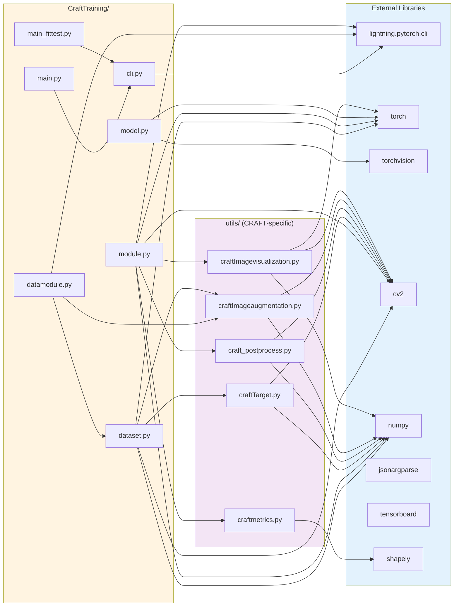
```mermaid
graph LR
    subgraph CraftTraining["CraftTraining/"]
        CLI["cli.py"]
        Main["main.py"]
        MainFitTest["main_fittest.py"]
        DataModule["datamodule.py"]
        Dataset["dataset.py"]
        Module["module.py"]
        Model["model.py"]
    end
    
    subgraph Utils["utils/ (CRAFT-specific)"]
        CraftTarget["craftTarget.py"]
        CraftMetrics["craftmetrics.py"]
        CraftPostProcess["craft_postprocess.py"]
        CraftImageAug["craftImageaugmentation.py"]
        CraftImageViz["craftImagevisualization.py"]
    end
    
    subgraph External["External Libraries"]
        Lightning["lightning.pytorch.cli"]
        Torch["torch"]
        TorchVision["torchvision"]
        CV2["cv2"]
        Numpy["numpy"]
        JSONArgParse["jsonargparse"]
        TensorBoard["tensorboard"]
        Shapely["shapely"]
    end
    
    CLI --> Lightning
    Main --> CLI
    MainFitTest --> CLI
    DataModule --> Lightning
    DataModule --> Dataset
    DataModule --> CraftImageAug
    Dataset --> Torch
    Dataset --> CV2
    Dataset --> Numpy
    Dataset --> CraftImageAug
    Dataset --> CraftTarget
    Module --> Lightning
    Module --> Torch
    Module --> CV2
    Module --> Numpy
    Module --> CraftImageViz
    Module --> CraftMetrics
    Module --> CraftPostProcess
    Model --> Torch
    Model --> TorchVision
    
    CraftTarget --> CV2
    CraftTarget --> Numpy
    CraftMetrics --> Shapely
    CraftPostProcess --> CV2
    CraftPostProcess --> Numpy
    CraftImageAug --> CV2
    CraftImageAug --> Numpy
    CraftImageViz --> CV2
    CraftImageViz --> Numpy
    CraftImageViz --> Torch
    
    style CraftTraining fill:#fff4e1
    style Utils fill:#f3e5f5
    style External fill:#e3f2fd
```

### Data Flow Between Modules

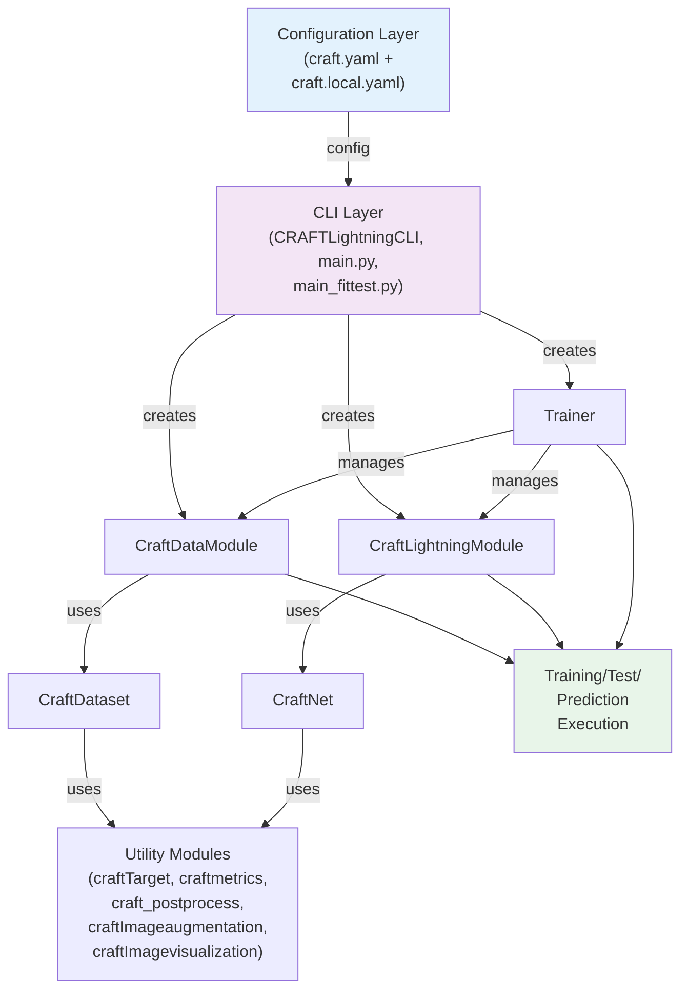
```mermaid
flowchart TD
    ConfigLayer["Configuration Layer<br/>(craft.yaml +<br/>craft.local.yaml)"]
    
    CLILayer["CLI Layer<br/>(CRAFTLightningCLI, main.py,<br/>main_fittest.py)"]
    
    DataModule["CraftDataModule"]
    ModelModule["CraftLightningModule"]
    Trainer["Trainer"]
    
    CraftDataset["CraftDataset"]
    CraftNet["CraftNet"]
    
    UtilsModules["Utility Modules<br/>(craftTarget, craftmetrics,<br/>craft_postprocess,<br/>craftImageaugmentation,<br/>craftImagevisualization)"]
    
    Execution["Training/Test/<br/>Prediction<br/>Execution"]
    
    ConfigLayer -->|config| CLILayer
    CLILayer -->|creates| DataModule
    CLILayer -->|creates| ModelModule
    CLILayer -->|creates| Trainer
    
    DataModule -->|uses| CraftDataset
    ModelModule -->|uses| CraftNet
    Trainer -->|manages| DataModule
    Trainer -->|manages| ModelModule
    
    CraftDataset -->|uses| UtilsModules
    CraftNet -->|uses| UtilsModules
    
    DataModule --> Execution
    ModelModule --> Execution
    Trainer --> Execution
    
    style ConfigLayer fill:#e3f2fd
    style CLILayer fill:#f3e5f5
    style Execution fill:#e8f5e9
```

---

## Data Flow Diagrams

### Training Data Flow

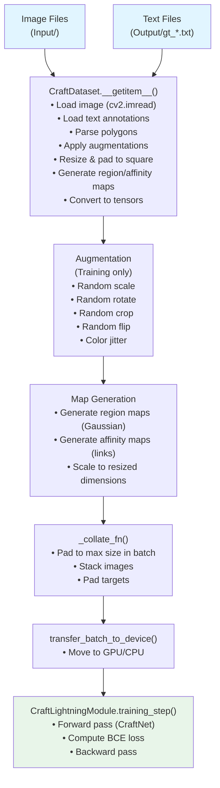
```mermaid
flowchart TD
    ImageFiles["Image Files<br/>(Input/)"]
    TextFiles["Text Files<br/>(Output/gt_*.txt)"]
    
    CraftDataset["CraftDataset.__getitem__()<br/>• Load image (cv2.imread)<br/>• Load text annotations<br/>• Parse polygons<br/>• Apply augmentations<br/>• Resize & pad to square<br/>• Generate region/affinity maps<br/>• Convert to tensors"]
    
    Augmentation["Augmentation<br/>(Training only)<br/>• Random scale<br/>• Random rotate<br/>• Random crop<br/>• Random flip<br/>• Color jitter"]
    
    MapGeneration["Map Generation<br/>• Generate region maps (Gaussian)<br/>• Generate affinity maps (links)<br/>• Scale to resized dimensions"]
    
    CollateFn["_collate_fn()<br/>• Pad to max size in batch<br/>• Stack images<br/>• Pad targets"]
    
    TransferDevice["transfer_batch_to_device()<br/>• Move to GPU/CPU"]
    
    TrainingStep["CraftLightningModule.training_step()<br/>• Forward pass (CraftNet)<br/>• Compute BCE loss<br/>• Backward pass"]
    
    ImageFiles --> CraftDataset
    TextFiles --> CraftDataset
    CraftDataset --> Augmentation
    Augmentation --> MapGeneration
    MapGeneration --> CollateFn
    CollateFn --> TransferDevice
    TransferDevice --> TrainingStep
    
    style ImageFiles fill:#e1f5ff
    style TextFiles fill:#e1f5ff
    style TrainingStep fill:#e8f5e9
```

### Inference Data Flow

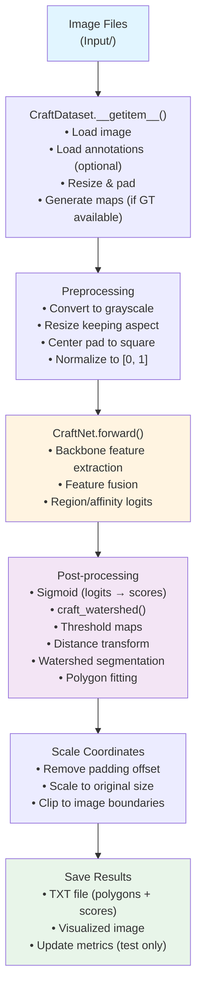
```mermaid
flowchart TD
    ImageFiles["Image Files<br/>(Input/)"]
    
    CraftDataset["CraftDataset.__getitem__()<br/>• Load image<br/>• Load annotations (optional)<br/>• Resize & pad<br/>• Generate maps (if GT available)"]
    
    PreProcess["Preprocessing<br/>• Convert to grayscale<br/>• Resize keeping aspect<br/>• Center pad to square<br/>• Normalize to [0, 1]"]
    
    Inference["CraftNet.forward()<br/>• Backbone feature extraction<br/>• Feature fusion<br/>• Region/affinity logits"]
    
    PostProcess["Post-processing<br/>• Sigmoid (logits → scores)<br/>• craft_watershed()<br/>• Threshold maps<br/>• Distance transform<br/>• Watershed segmentation<br/>• Polygon fitting"]
    
    ScaleCoords["Scale Coordinates<br/>• Remove padding offset<br/>• Scale to original size<br/>• Clip to image boundaries"]
    
    SaveResults["Save Results<br/>• TXT file (polygons + scores)<br/>• Visualized image<br/>• Update metrics (test only)"]
    
    ImageFiles --> CraftDataset
    CraftDataset --> PreProcess
    PreProcess --> Inference
    Inference --> PostProcess
    PostProcess --> ScaleCoords
    ScaleCoords --> SaveResults
    
    style ImageFiles fill:#e1f5ff
    style Inference fill:#fff4e1
    style PostProcess fill:#f3e5f5
    style SaveResults fill:#e8f5e9
```

### Region/Affinity Map Generation Flow

```mermaid
flowchart TD
    Polygons["Polygon Annotations<br/>(List of 4-point quads)"]
    
    Words["Word Grouping<br/>(List of character indices)"]
    
    CharMasks["Character Masks<br/>• Rasterize polygons<br/>• Create binary masks"]
    
    RegionMap["Region Map Generation<br/>• Enlarge character masks<br/>• Gaussian blur (sigma scaled)<br/>• Accumulate via max"]
    
    AffinityMap["Affinity Map Generation<br/>• For each word<br/>• Connect adjacent characters<br/>• Union + dilation<br/>• Gaussian blur<br/>• Accumulate via max"]
    
    OutputMaps["Output Maps<br/>• Region map (H, W)<br/>• Affinity map (H, W)<br/>• Values in [0, 1]"]
    
    Polygons --> CharMasks
    Words --> AffinityMap
    CharMasks --> RegionMap
    CharMasks --> AffinityMap
    RegionMap --> OutputMaps
    AffinityMap --> OutputMaps
    
    style Polygons fill:#e1f5ff
    style RegionMap fill:#fff4e1
    style AffinityMap fill:#f3e5f5
    style OutputMaps fill:#e8f5e9
```

### Watershed Post-Processing Flow

```mermaid
flowchart TD
    RegionScore["Region Score<br/>(H, W) float [0, 1]"]
    AffinityScore["Affinity Score<br/>(H, W) float [0, 1]"]
    
    Threshold["Threshold Maps<br/>• text_threshold → textmap<br/>• link_threshold → linkmap<br/>• low_text → low_textmap"]
    
    Combined["Combined Mask<br/>• low_textmap OR linkmap<br/>• Morphological closing"]
    
    Distance["Distance Transform<br/>• On textmap (cores)<br/>• Find peaks (seeds)"]
    
    Seeds["Seed Generation<br/>• Threshold distance transform<br/>• Dilate to connect<br/>• Connected components"]
    
    Watershed["Watershed Algorithm<br/>• Markers from seeds<br/>• Unknown regions<br/>• Segment regions"]
    
    Contours["Contour Extraction<br/>• Find contours per region<br/>• Filter by min_area<br/>• Pick largest contour"]
    
    Polygons["Polygon Fitting<br/>• approxPolyDP or minAreaRect<br/>• Order clockwise<br/>• 4-point quadrilateral"]
    
    Scoring["Score Computation<br/>• Mean region score<br/>• Per polygon"]
    
    Output["Output<br/>• List of (polygon, score)<br/>• Quadrilateral polygons"]
    
    RegionScore --> Threshold
    AffinityScore --> Threshold
    Threshold --> Combined
    Threshold --> Distance
    Distance --> Seeds
    Seeds --> Watershed
    Combined --> Watershed
    Watershed --> Contours
    Contours --> Polygons
    RegionScore --> Scoring
    Polygons --> Scoring
    Scoring --> Output
    
    style RegionScore fill:#e1f5ff
    style Watershed fill:#fff4e1
    style Polygons fill:#f3e5f5
    style Output fill:#e8f5e9
```

---

## Configuration Flow

```mermaid
flowchart TD
    BaseConfig["craft.yaml<br/>(Base Configuration)"]
    
    LocalConfig["craft.local.yaml<br/>(Local Overrides)"]
    
    Parser["JSONArgParse / LightningCLI"]
    
    TrainerConfig["Trainer<br/>Config"]
    ModelConfig["Model<br/>Config<br/>(CraftLightningModule + CraftNet)"]
    DataConfig["Data<br/>Config<br/>(CraftDataModule)"]
    
    Execution["PyTorch Lightning<br/>Execution"]
    
    BaseConfig -->|merged with| LocalConfig
    LocalConfig -->|parsed by| Parser
    Parser -->|creates| TrainerConfig
    Parser -->|creates| ModelConfig
    Parser -->|creates| DataConfig
    TrainerConfig -->|instantiates| Execution
    ModelConfig -->|instantiates| Execution
    DataConfig -->|instantiates| Execution
    
    style BaseConfig fill:#e3f2fd
    style LocalConfig fill:#fff3e0
    style Execution fill:#e8f5e9
```

---

## Summary

This document provides comprehensive diagrams and design documentation for the CraftTraining project. The system follows a modular, extensible architecture based on PyTorch Lightning, making it easy to:

1. **Train CRAFT models** for text detection tasks
2. **Customize model architecture** via configuration (backbone freezing, head channels)
3. **Extend functionality** through utility modules
4. **Configure workflows** through YAML files

The design separates concerns:
- **CraftTraining/**: Core CRAFT training components
- **utils/**: CRAFT-specific utilities (target generation, post-processing, metrics)

The CRAFT model uses a VGG16-BN backbone with FPN-like feature fusion to predict region and affinity maps, which are post-processed using watershed algorithm to extract text regions as quadrilateral polygons.
