# UML Diagrams and Design Documentation - EasyOCRTraining

This document contains comprehensive UML diagrams, class diagrams, sequence diagrams, High-Level Design (HLD), Low-Level Design (LLD), EasyOCR model architecture, and visual representations of the project structure and interconnections.

## Table of Contents

- [High-Level Design (HLD)](#high-level-design-hld)
- [Low-Level Design (LLD)](#low-level-design-lld)
- [Class Diagrams](#class-diagrams)
- [EasyOCR Model Architecture](#easyocr-model-architecture)
- [Sequence Diagrams](#sequence-diagrams)
- [Folder and File Structure](#folder-and-file-structure)
- [Module Interconnections](#module-interconnections)
- [Data Flow Diagrams](#data-flow-diagrams)

---

## High-Level Design (HLD)

### System Overview

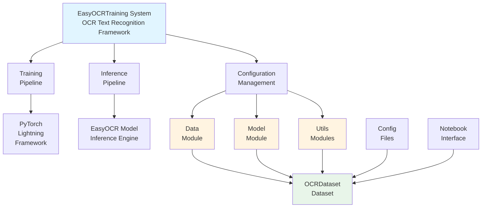

### Component Architecture

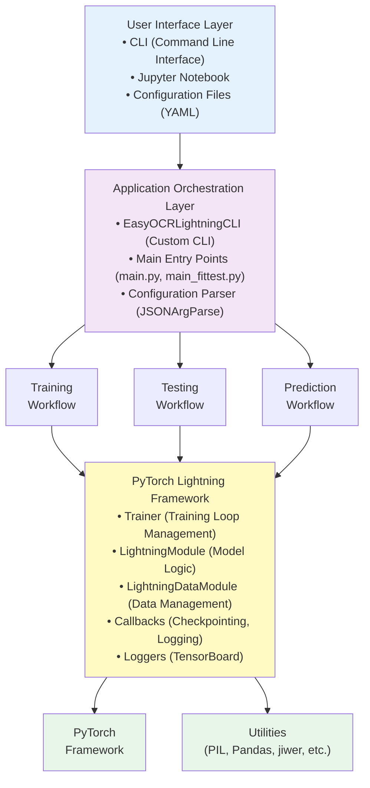

### Data Flow Architecture

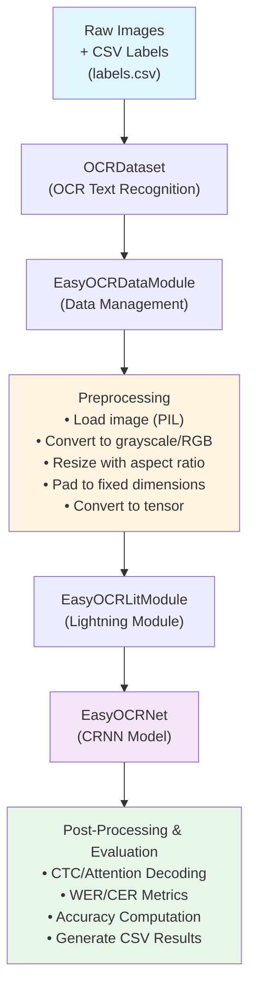

---

## Low-Level Design (LLD)

### Module Dependencies

```
EasyOCRTraining/
├── cli.py
│   └── depends on: lightning.pytorch.cli
│
├── main.py
│   └── depends on: cli.py
│
├── main_fittest.py
│   └── depends on: cli.py
│
├── datamodule.py
│   ├── depends on: lightning, EasyOCRTraining.dataset
│   └── exports: EasyOCRDataModule
│
├── dataset.py
│   ├── depends on: torch.utils.data, PIL, torchvision, pandas
│   └── exports: OCRDataset, AlignCollate
│
├── module.py
│   ├── depends on: lightning, torch, EasyOCRTraining.model, EasyOCRTraining.utilities.labelconverter, utils.easyocrmetrics
│   └── exports: EasyOCRLitModule
│
├── model.py
│   ├── depends on: torch.nn, EasyOCRTraining.utilities.*
│   └── exports: EasyOCRNet
│
└── utilities/
    ├── feature_extraction.py
    │   └── exports: VGG_FeatureExtractor, ResNet_FeatureExtractor, RCNN_FeatureExtractor, GRCL
    │
    ├── sequence_modeling.py
    │   └── exports: BidirectionalLSTM
    │
    ├── prediction.py
    │   └── exports: Attention, AttentionCell
    │
    ├── transformation.py
    │   └── exports: TPS_SpatialTransformerNetwork, LocalizationNetwork, GridGenerator
    │
    └── labelconverter.py
        └── exports: CTCLabelConverter, AttnLabelConverter

utils/ (EasyOCR-specific)
└── easyocrmetrics.py
    └── exports: EasyOCRMetricsManager
```

---

## Class Diagrams

### Core Classes Diagram

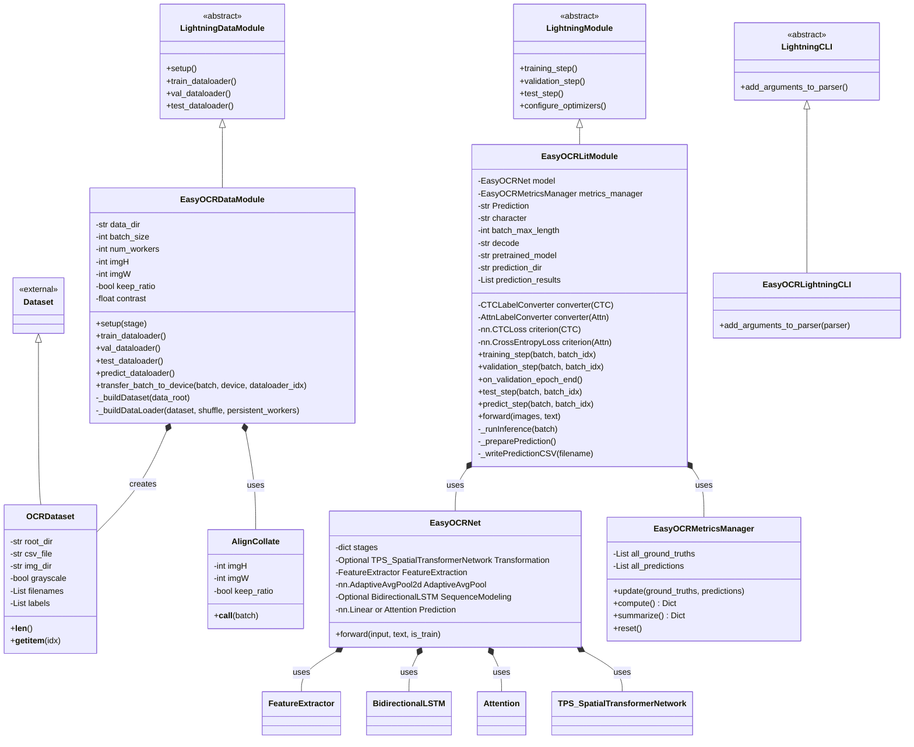

### Detailed EasyOCRLitModule Class

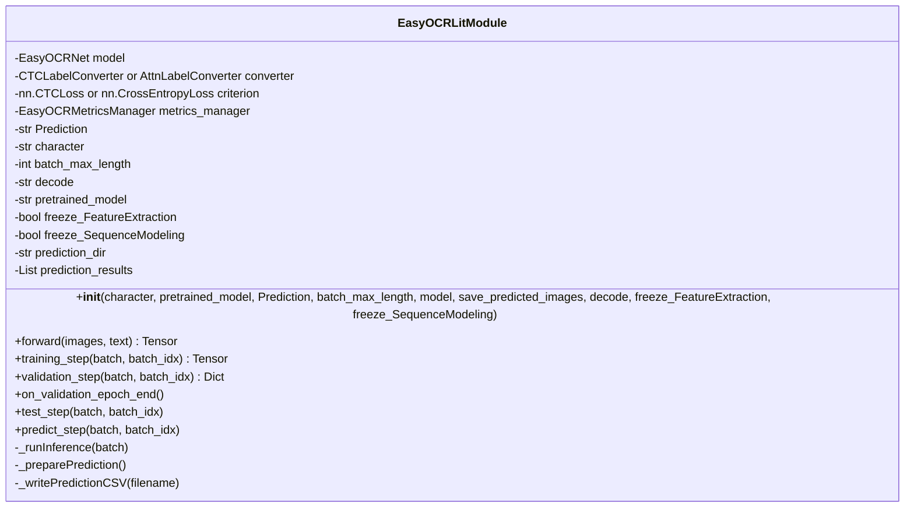

### Detailed EasyOCRDataModule Class

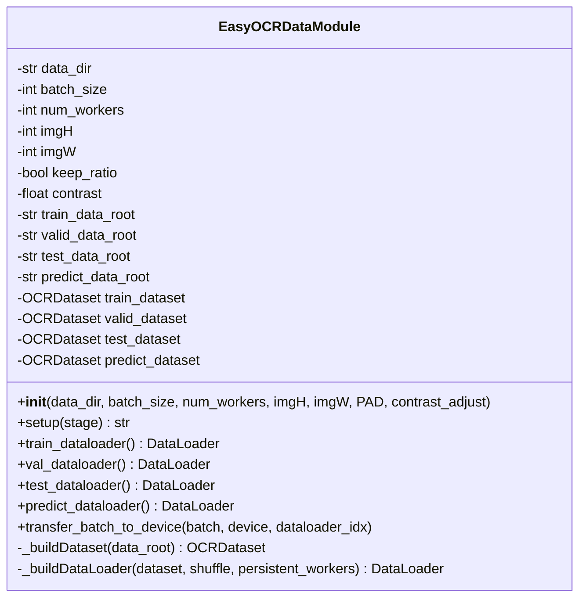

### Detailed EasyOCRNet Class

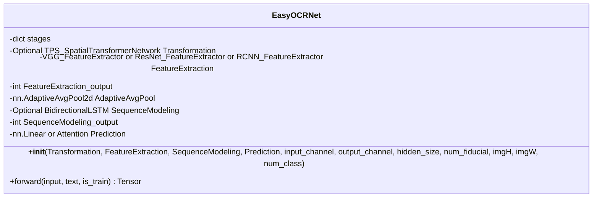

---

## EasyOCR Model Architecture

### Model Architecture Overview

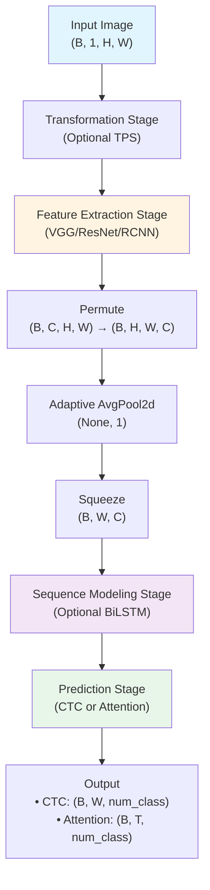

### Four-Stage Architecture Detail

```mermaid
flowchart LR
    subgraph Stage1["Stage 1: Transformation<br/>(Optional)"]
        TPS["TPS Spatial Transformer<br/>Network"]
        None["None (Identity)"]
    end
    
    subgraph Stage2["Stage 2: Feature Extraction"]
        VGG["VGG Feature<br/>Extractor"]
        ResNet["ResNet Feature<br/>Extractor"]
        RCNN["RCNN Feature<br/>Extractor"]
    end
    
    subgraph Stage3["Stage 3: Sequence Modeling<br/>(Optional)"]
        BiLSTM["Bidirectional<br/>LSTM"]
        None2["None (Identity)"]
    end
    
    subgraph Stage4["Stage 4: Prediction"]
        CTC["CTC<br/>(Linear Layer)"]
        Attn["Attention<br/>(Seq2Seq)"]
    end
    
    Input --> Stage1
    Stage1 --> Stage2
    Stage2 --> Stage3
    Stage3 --> Stage4
    Stage4 --> Output
    
    style Stage1 fill:#e3f2fd
    style Stage2 fill:#fff3e0
    style Stage3 fill:#f3e5f5
    style Stage4 fill:#e8f5e9
```

### Feature Extraction Architectures

```mermaid
flowchart TD
    Input["Input<br/>(B, 1, H, W)"]
    
    subgraph VGG["VGG Feature Extractor"]
        V1["Conv(1→64) + ReLU + MaxPool"]
        V2["Conv(64→128) + ReLU + MaxPool"]
        V3["Conv(128→256) + ReLU"]
        V4["Conv(256→256) + ReLU + MaxPool(2,1)"]
        V5["Conv(256→512) + BN + ReLU"]
        V6["Conv(512→512) + BN + ReLU + MaxPool(2,1)"]
        V7["Conv(512→512) + ReLU"]
        VOut["Output (B, 512, H', W')"]
    end
    
    subgraph ResNet["ResNet Feature Extractor"]
        R1["Conv0_1 + Conv0_2"]
        R2["MaxPool1 + Layer1 + Conv1"]
        R3["MaxPool2 + Layer2 + Conv2"]
        R4["MaxPool3 + Layer3 + Conv3"]
        R5["Layer4 + Conv4_1 + Conv4_2"]
        ROut["Output (B, 512, H', W')"]
    end
    
    subgraph RCNN["RCNN Feature Extractor"]
        RC1["Conv + ReLU + MaxPool"]
        RC2["GRCL + MaxPool"]
        RC3["GRCL + MaxPool"]
        RC4["GRCL + MaxPool"]
        RC5["Conv + BN + ReLU"]
        RCOut["Output (B, 512, H', W')"]
    end
    
    Input --> VGG
    Input --> ResNet
    Input --> RCNN
    
    V1 --> V2 --> V3 --> V4 --> V5 --> V6 --> V7 --> VOut
    R1 --> R2 --> R3 --> R4 --> R5 --> ROut
    RC1 --> RC2 --> RC3 --> RC4 --> RC5 --> RCOut
    
    style VGG fill:#fff4e1
    style ResNet fill:#f3e5f5
    style RCNN fill:#e8f5e9
```

### Sequence Modeling Flow

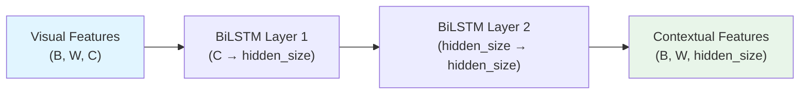

### Prediction Stage: CTC Flow

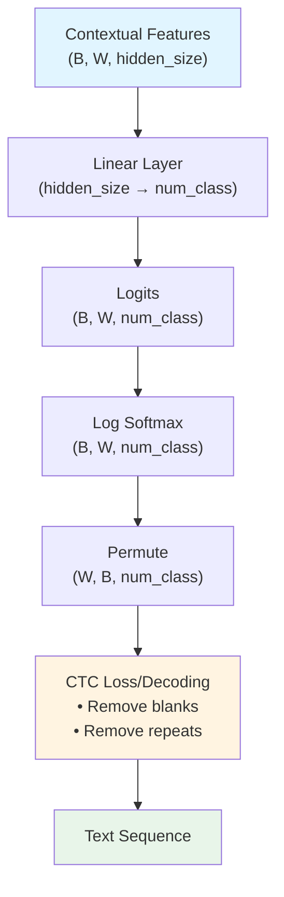

### Prediction Stage: Attention Flow

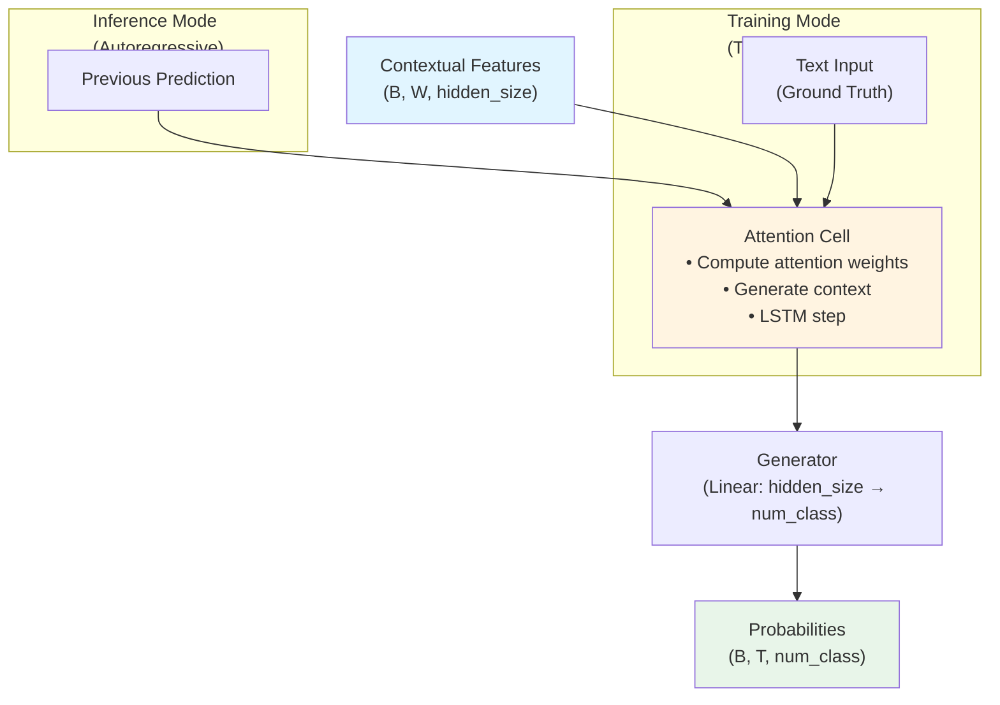

### TPS Transformation Flow

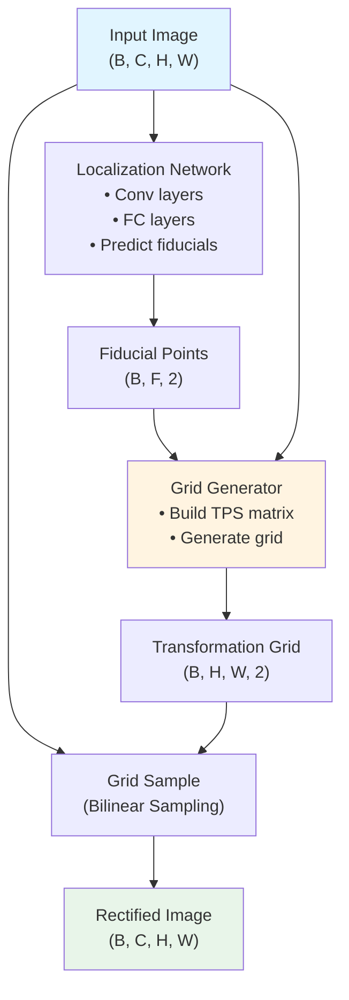

---

## Sequence Diagrams

### Training Sequence Diagram

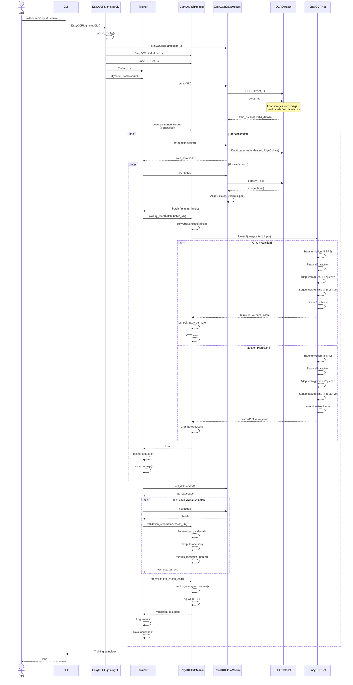

### Testing Sequence Diagram

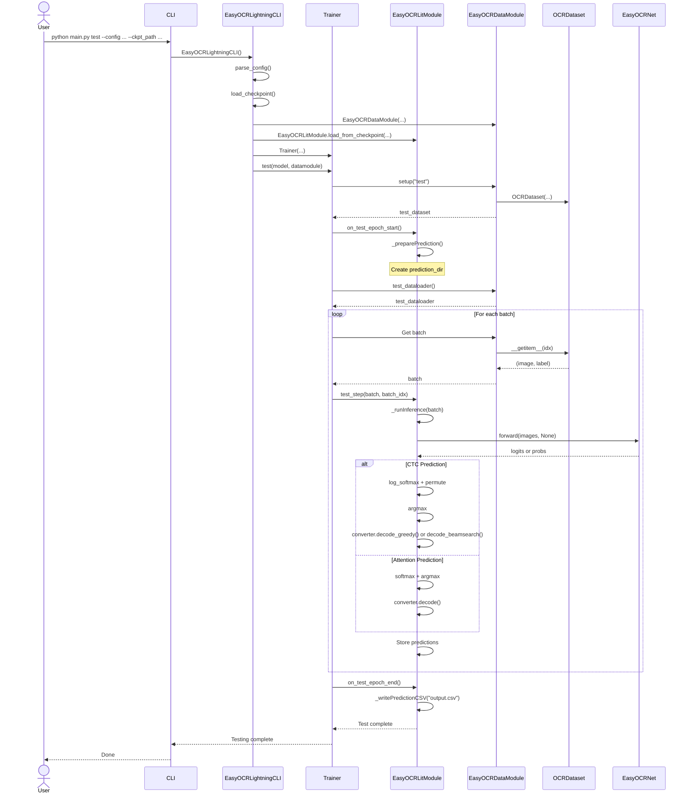

### Prediction Sequence Diagram

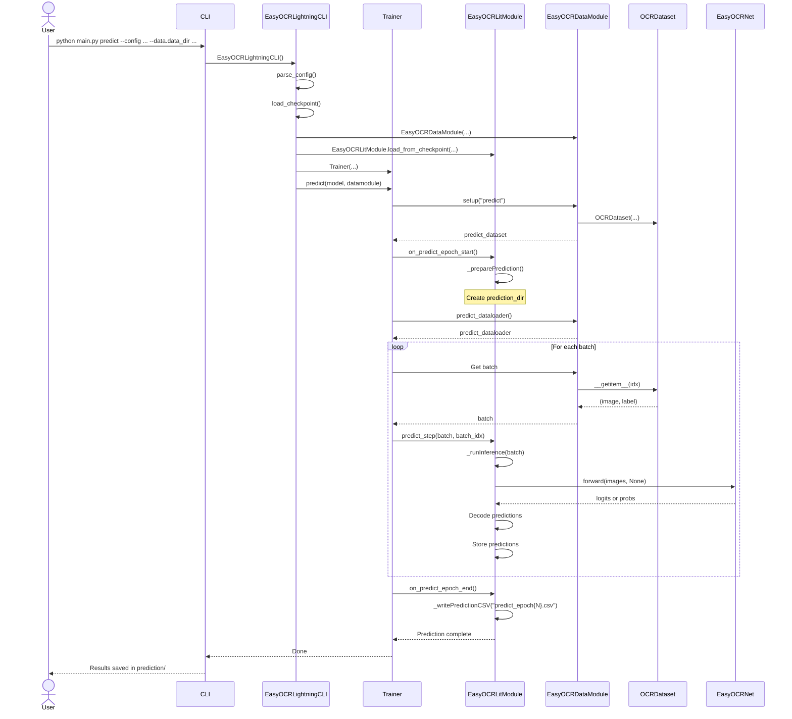

---

## Folder and File Structure

### Complete Project Structure

```mermaid
graph TD
    Root["EasyOCRTraining/"]
    
    Config["config/"]
    ConfigYAML["easyOCR.yaml"]
    
    Utilities["utilities/"]
    FeatureExtract["feature_extraction.py<br/>VGG, ResNet, RCNN"]
    SeqModeling["sequence_modeling.py<br/>BidirectionalLSTM"]
    Prediction["prediction.py<br/>Attention"]
    Transform["transformation.py<br/>TPS"]
    LabelConv["labelconverter.py<br/>CTC, Attn"]
    
    CLI["cli.py<br/>EasyOCRLightningCLI"]
    Main["main.py<br/>CLI Entry Point"]
    MainFitTest["main_fittest.py<br/>Fit + Test"]
    DataModule["datamodule.py<br/>EasyOCRDataModule"]
    Dataset["dataset.py<br/>OCRDataset, AlignCollate"]
    Module["module.py<br/>EasyOCRLitModule"]
    Model["model.py<br/>EasyOCRNet"]
    
    Utils["utils/"]
    Metrics["easyocrmetrics.py<br/>EasyOCRMetricsManager"]
    
    Notebook["EasyOCRTrainer.ipynb"]
    Readme["README.md"]
    UML["UML_DIAGRAMS.md"]
    
    Root --> Config
    Root --> Utilities
    Root --> CLI
    Root --> Main
    Root --> MainFitTest
    Root --> DataModule
    Root --> Dataset
    Root --> Module
    Root --> Model
    Root --> Readme
    Root --> UML
    
    Config --> ConfigYAML
    
    Utilities --> FeatureExtract
    Utilities --> SeqModeling
    Utilities --> Prediction
    Utilities --> Transform
    Utilities --> LabelConv
    
    Utils --> Metrics
    
    style Root fill:#e1f5ff
    style Model fill:#fff4e1
    style Module fill:#e8f5e9
    style Utilities fill:#f3e5f5
```

### Dependency Graph

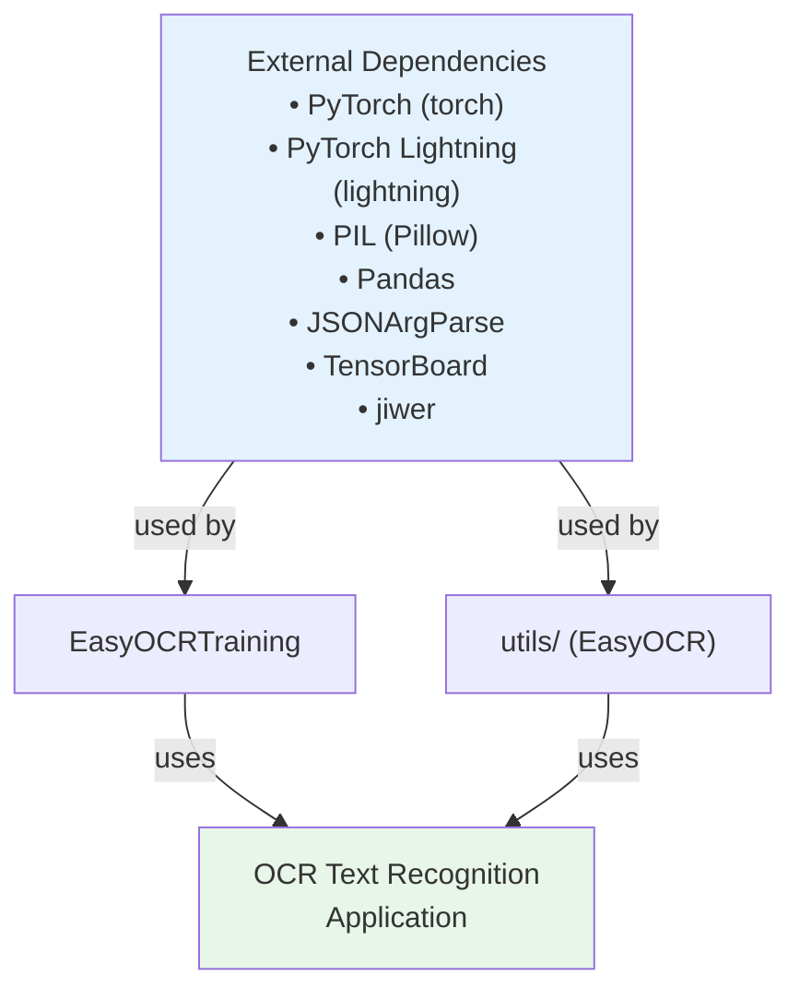

---

## Module Interconnections

### Import Dependencies

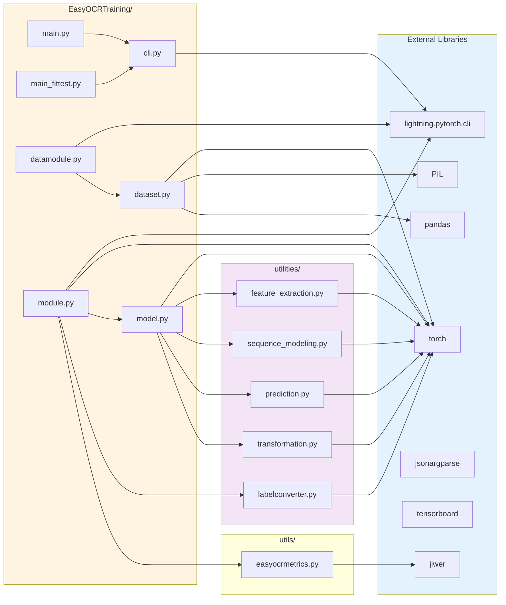

### Data Flow Between Modules

```mermaid
flowchart TD
    ConfigLayer["Configuration Layer<br/>(easyOCR.yaml)"]
    
    CLILayer["CLI Layer<br/>(EasyOCRLightningCLI, main.py,<br/>main_fittest.py)"]
    
    DataModule["EasyOCRDataModule"]
    ModelModule["EasyOCRLitModule"]
    Trainer["Trainer"]
    
    OCRDataset["OCRDataset"]
    EasyOCRNet["EasyOCRNet"]
    
    UtilsModules["Utility Modules<br/>(feature_extraction,<br/>sequence_modeling,<br/>prediction,<br/>transformation,<br/>labelconverter)"]
    
    Execution["Training/Test/<br/>Prediction<br/>Execution"]
    
    ConfigLayer -->|config| CLILayer
    CLILayer -->|creates| DataModule
    CLILayer -->|creates| ModelModule
    CLILayer -->|creates| Trainer
    
    DataModule -->|uses| OCRDataset
    ModelModule -->|uses| EasyOCRNet
    Trainer -->|manages| DataModule
    Trainer -->|manages| ModelModule
    
    EasyOCRNet -->|uses| UtilsModules
    
    DataModule --> Execution
    ModelModule --> Execution
    Trainer --> Execution
    
    style ConfigLayer fill:#e3f2fd
    style CLILayer fill:#f3e5f5
    style Execution fill:#e8f5e9
```

---

## Data Flow Diagrams

### Training Data Flow

```mermaid
flowchart TD
    ImageFiles["Image Files<br/>(images/)"]
    CSVFile["CSV File<br/>(labels.csv)"]
    
    OCRDataset["OCRDataset.__getitem__()<br/>• Load image (PIL)<br/>• Load label from CSV<br/>• Convert to grayscale/RGB<br/>• Return (image, label)"]
    
    AlignCollate["AlignCollate()<br/>• Resize with aspect ratio<br/>• Pad to fixed dimensions<br/>• Convert to tensor<br/>• Stack into batch"]
    
    Encode["Label Encoding<br/>• CTC: text → indices (with blank)<br/>• Attention: text → indices (with [GO], [s])"]
    
    ModelForward["Model Forward Pass<br/>• Transformation (optional TPS)<br/>• Feature Extraction (VGG/ResNet/RCNN)<br/>• AdaptiveAvgPool + Squeeze<br/>• Sequence Modeling (optional BiLSTM)<br/>• Prediction (CTC or Attention)"]
    
    Loss["Loss Computation<br/>• CTC: CTCLoss<br/>• Attention: CrossEntropyLoss"]
    
    TrainingStep["training_step()<br/>• Backward pass<br/>• Optimizer step"]
    
    ImageFiles --> OCRDataset
    CSVFile --> OCRDataset
    OCRDataset --> AlignCollate
    AlignCollate --> Encode
    Encode --> ModelForward
    ModelForward --> Loss
    Loss --> TrainingStep
    
    style ImageFiles fill:#e1f5ff
    style CSVFile fill:#e1f5ff
    style TrainingStep fill:#e8f5e9
```

### Inference Data Flow

```mermaid
flowchart TD
    ImageFiles["Image Files<br/>(images/)"]
    
    OCRDataset["OCRDataset.__getitem__()<br/>• Load image<br/>• Load label (optional)<br/>• Convert to grayscale/RGB"]
    
    AlignCollate["AlignCollate()<br/>• Resize with aspect ratio<br/>• Pad to fixed dimensions<br/>• Convert to tensor"]
    
    ModelForward["Model Forward Pass<br/>• Transformation (if TPS)<br/>• Feature Extraction<br/>• AdaptiveAvgPool + Squeeze<br/>• Sequence Modeling (if BiLSTM)<br/>• Prediction"]
    
    Decode["Decoding<br/>• CTC: decode_greedy() or decode_beamsearch()<br/>• Attention: decode()"]
    
    PostProcess["Post-Processing<br/>• Remove blanks (CTC)<br/>• Remove repeats (CTC)<br/>• Remove tokens (Attention)"]
    
    SaveResults["Save Results<br/>• CSV file (ground_truth, predicted_text)<br/>• Update metrics (test only)"]
    
    ImageFiles --> OCRDataset
    OCRDataset --> AlignCollate
    AlignCollate --> ModelForward
    ModelForward --> Decode
    Decode --> PostProcess
    PostProcess --> SaveResults
    
    style ImageFiles fill:#e1f5ff
    style ModelForward fill:#fff4e1
    style Decode fill:#f3e5f5
    style SaveResults fill:#e8f5e9
```

### CTC Encoding/Decoding Flow

```mermaid
flowchart TD
    Text["Text String<br/>e.g., 'hello'"]
    
    Encode["CTC Encoding<br/>• Map chars to indices (1-N)<br/>• 0 reserved for blank<br/>• Example: 'hello' → [8,5,12,12,15]"]
    
    ModelOutput["Model Output<br/>• Logits (B, W, num_class)<br/>• Log softmax<br/>• Permute (W, B, num_class)"]
    
    Argmax["Argmax<br/>• Get indices<br/>• Example: [8,0,5,12,12,0,15]"]
    
    Decode["CTC Decoding<br/>• Remove blanks (0)<br/>• Remove repeats<br/>• Example: [8,0,5,12,12,0,15] → 'hello'"]
    
    Output["Decoded Text<br/>'hello'"]
    
    Text --> Encode
    Encode --> ModelOutput
    ModelOutput --> Argmax
    Argmax --> Decode
    Decode --> Output
    
    style Text fill:#e1f5ff
    style Encode fill:#fff4e1
    style Decode fill:#f3e5f5
    style Output fill:#e8f5e9
```

### Attention Encoding/Decoding Flow

```mermaid
flowchart TD
    Text["Text String<br/>e.g., 'hello'"]
    
    Encode["Attention Encoding<br/>• Add [GO] at start<br/>• Add [s] at end<br/>• Map to indices<br/>• Example: 'hello' → [[GO],'h','e','l','l','o',[s]]"]
    
    ModelForward["Model Forward<br/>• Teacher forcing (training)<br/>• Autoregressive (inference)"]
    
    ModelOutput["Model Output<br/>• Probabilities (B, T, num_class)<br/>• Softmax<br/>• Argmax"]
    
    Decode["Attention Decoding<br/>• Map indices to chars<br/>• Remove tokens<br/>• Example: [[GO],'h','e','l','l','o',[s]] → 'hello'"]
    
    Output["Decoded Text<br/>'hello'"]
    
    Text --> Encode
    Encode --> ModelForward
    ModelForward --> ModelOutput
    ModelOutput --> Decode
    Decode --> Output
    
    style Text fill:#e1f5ff
    style Encode fill:#fff4e1
    style Decode fill:#f3e5f5
    style Output fill:#e8f5e9
```

---

## Configuration Flow

```mermaid
flowchart TD
    BaseConfig["easyOCR.yaml<br/>(Base Configuration)"]
    
    Parser["JSONArgParse / LightningCLI"]
    
    TrainerConfig["Trainer<br/>Config"]
    ModelConfig["Model<br/>Config<br/>(EasyOCRLitModule + EasyOCRNet)"]
    DataConfig["Data<br/>Config<br/>(EasyOCRDataModule)"]
    
    Execution["PyTorch Lightning<br/>Execution"]
    
    BaseConfig -->|parsed by| Parser
    Parser -->|creates| TrainerConfig
    Parser -->|creates| ModelConfig
    Parser -->|creates| DataConfig
    TrainerConfig -->|instantiates| Execution
    ModelConfig -->|instantiates| Execution
    DataConfig -->|instantiates| Execution
    
    style BaseConfig fill:#e3f2fd
    style Execution fill:#e8f5e9
```

---

## Summary

This document provides comprehensive diagrams and design documentation for the EasyOCRTraining project. The system follows a modular, extensible architecture based on PyTorch Lightning, making it easy to:

1. **Train OCR models** for text recognition tasks
2. **Customize model architecture** via configuration (feature extractor, sequence modeling, prediction method)
3. **Extend functionality** through utility modules
4. **Configure workflows** through YAML files

The design separates concerns:
- **EasyOCRTraining/**: Core OCR training components
- **utilities/**: Model component implementations (feature extraction, sequence modeling, prediction, transformation, label conversion)
- **utils/**: Shared utilities (metrics)

The EasyOCR model uses a four-stage architecture (Transformation → Feature Extraction → Sequence Modeling → Prediction) with flexible components for each stage, supporting multiple feature extractors (VGG, ResNet, RCNN) and prediction methods (CTC, Attention) to handle various text recognition scenarios.
