# UML Diagrams and Design Documentation

This document contains comprehensive UML diagrams, class diagrams, sequence diagrams, High-Level Design (HLD), Low-Level Design (LLD), and visual representations of the project structure and interconnections.

## Table of Contents

- [High-Level Design (HLD)](#high-level-design-hld)
- [Low-Level Design (LLD)](#low-level-design-lld)
- [Class Diagrams](#class-diagrams)
- [Sequence Diagrams](#sequence-diagrams)
- [Folder and File Structure](#folder-and-file-structure)
- [Module Interconnections](#module-interconnections)
- [Data Flow Diagrams](#data-flow-diagrams)

---

## High-Level Design (HLD)

### System Overview

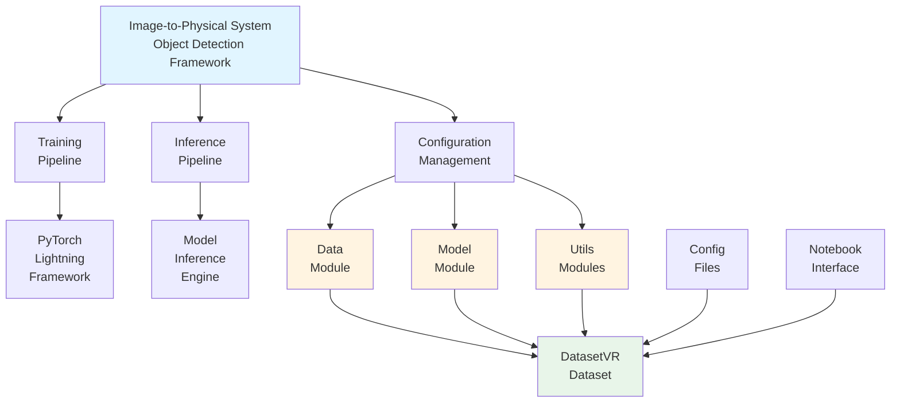

### Component Architecture

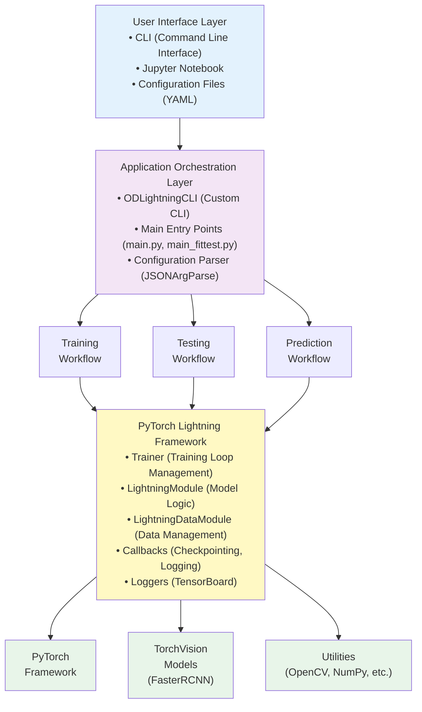

### Data Flow Architecture

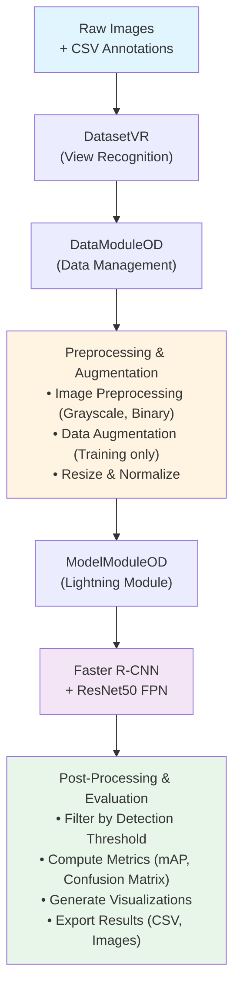

---

## Low-Level Design (LLD)

### Module Dependencies

```
ObjectDetection/
├── cli.py
│   └── depends on: lightning.pytorch.cli
│
├── main.py
│   └── depends on: cli.py
│
├── main_fittest.py
│   └── depends on: cli.py
│
├── datamodule.py
│   ├── depends on: lightning, utils.lib, ObjectDetection.dataset, utils.dataset, utils.imageaugmentation
│   └── exports: DataModuleOD
│
├── dataset.py
│   ├── depends on: torch.utils.data, cv2, numpy, utils.imageaugmentation
│   └── exports: DatasetOD, DatasetImage
│
├── modelmodule.py
│   ├── depends on: lightning, utils.lib, utils.imagevisualization, utils.colors, torchmetrics, utils.metrics
│   └── exports: ModelModuleOD
│
└── modelfactory.py
    └── depends on: torch, torchvision
    └── exports: getModelfasterrcnn_resnet50_fpn

ViewRecognition/
├── dataset.py
│   ├── depends on: ObjectDetection.dataset, utils.imageaugmentation, utils.image
│   └── exports: DatasetVR
│
└── config/
    ├── viewrecognition.yaml
    └── viewrecognition.local.yaml

utils/
├── colors.py
│   └── exports: getRandomBASEColors, getRandomTABLEAUColors, hex_to_bgr
│
├── dataset.py
│   └── exports: collate_fn
│
├── image.py
│   └── exports: convertToBoundingBox
│
├── imageaugmentation.py
│   └── exports: preProcess, getTransform, getNoTransform
│
├── imagevisualization.py
│   └── exports: drawCV2BBWithText, visualizeOneBatchImages, visualizeImage
│
├── lib.py
│   └── exports: getCallableAndArgs, getAttr
│
└── metrics.py
    └── exports: computeIOU, computeBBConfusionMatrix
```

---

## Class Diagrams

### Core Classes Diagram

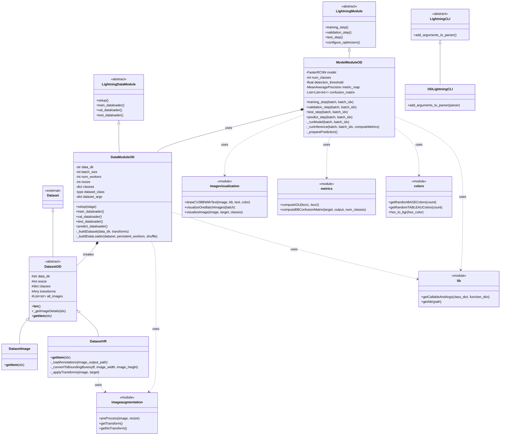

### Detailed ModelModuleOD Class

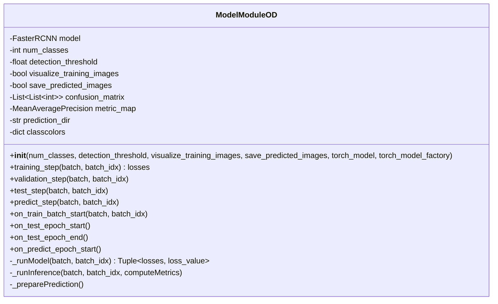

### Detailed DataModuleOD Class

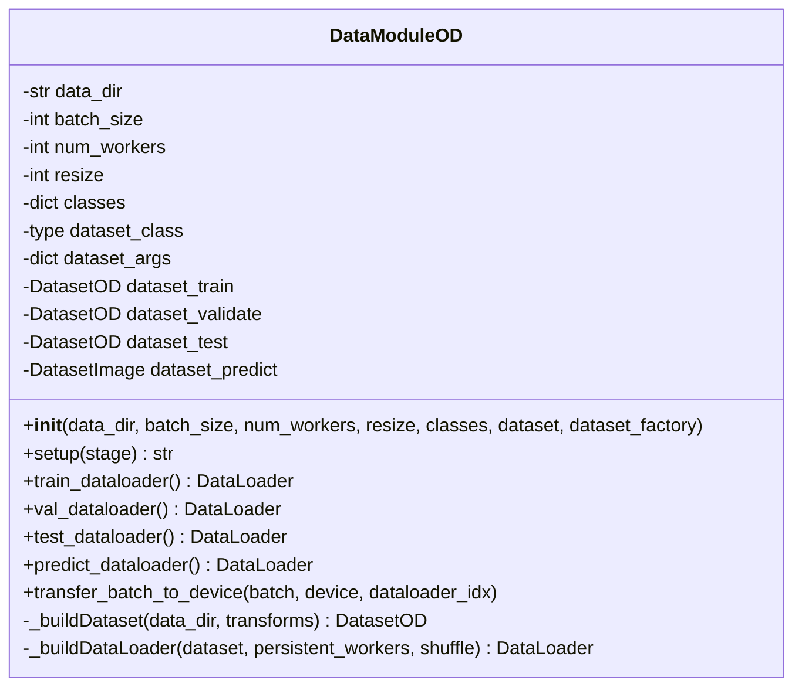

### Dataset Class Hierarchy

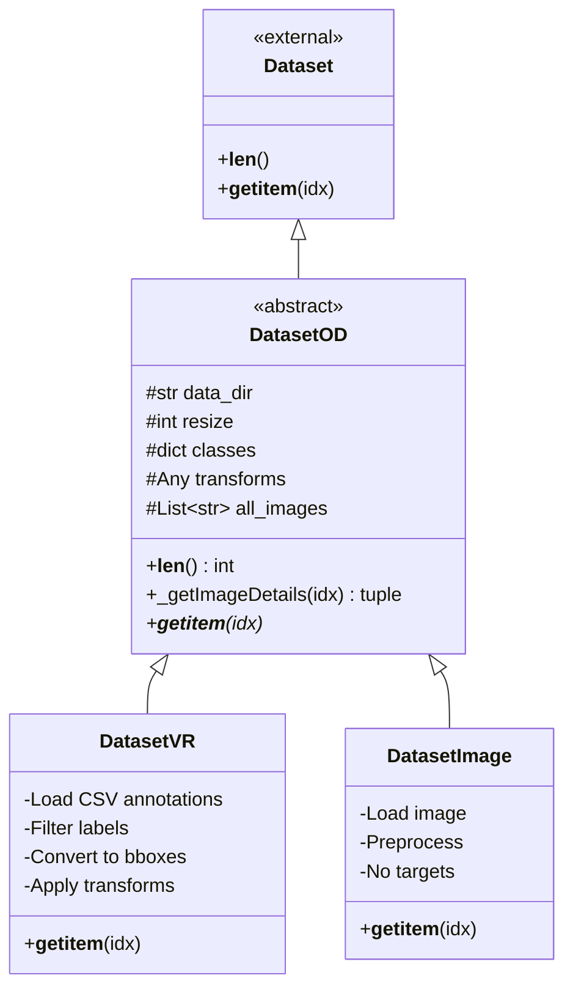

---

## Sequence Diagrams

### Training Sequence Diagram

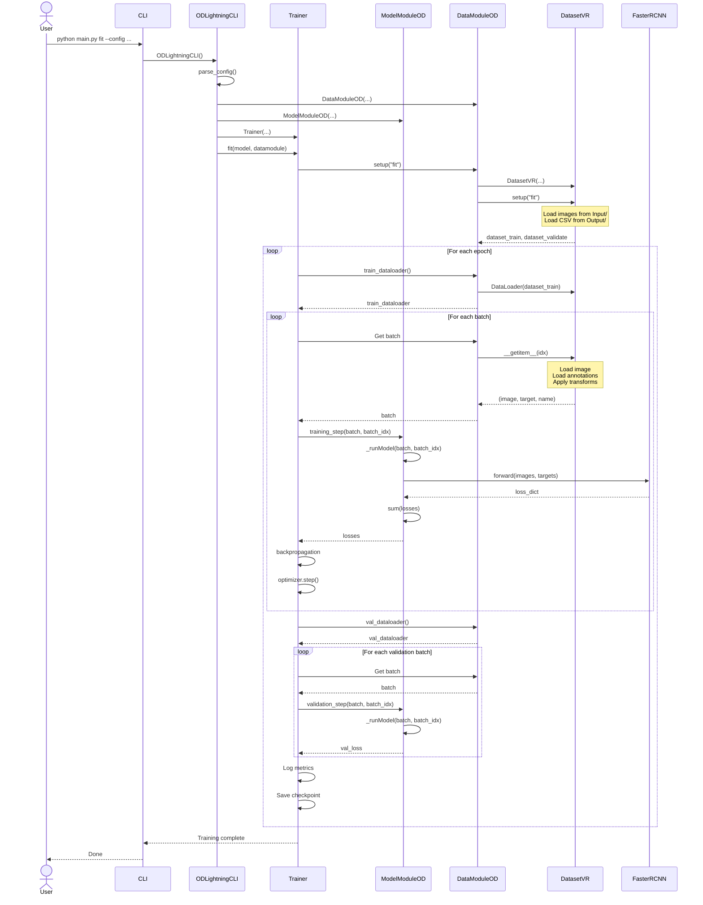

### Testing Sequence Diagram

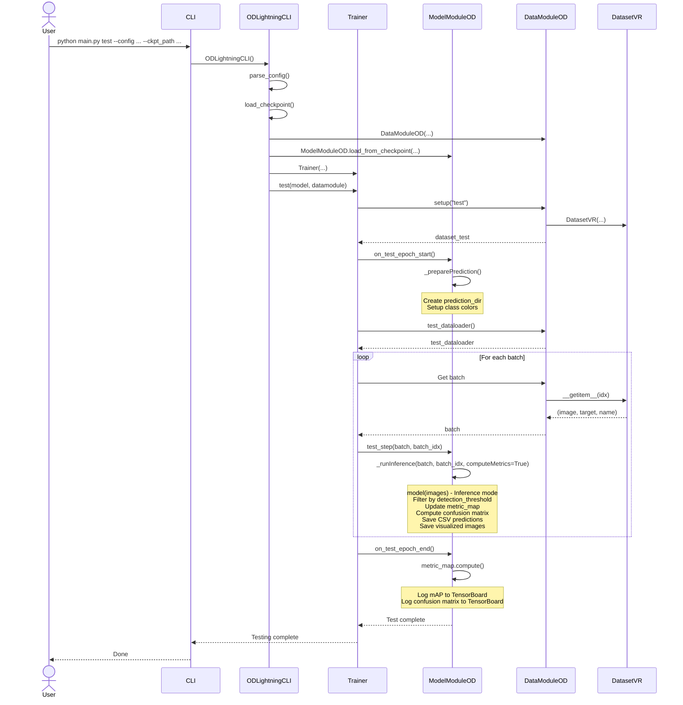

### Prediction Sequence Diagram

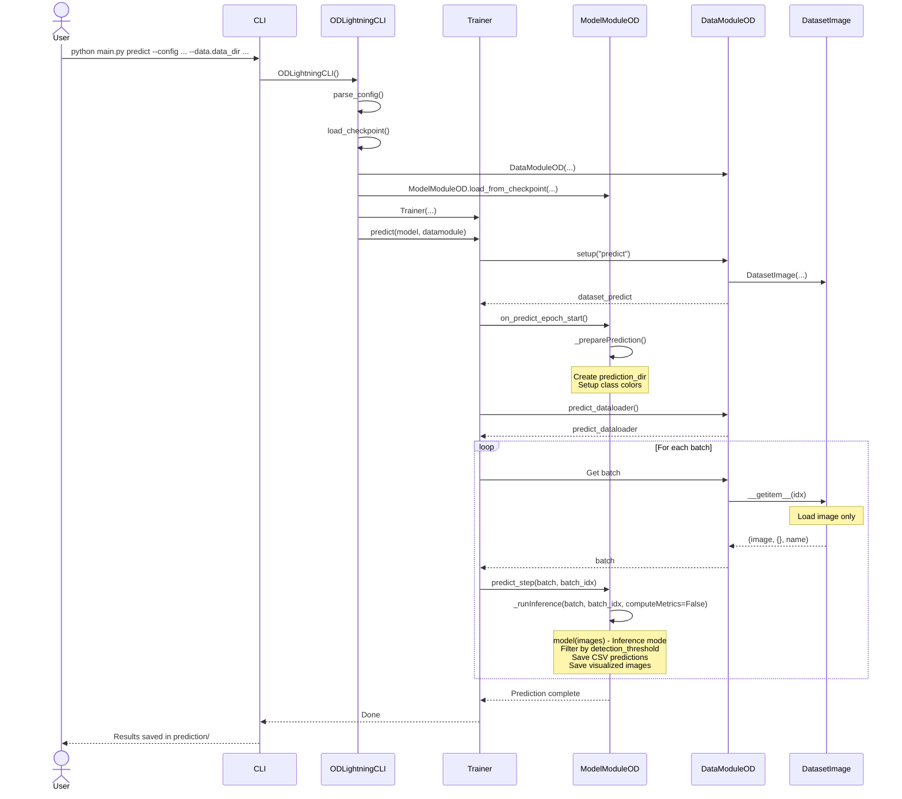

---

## Folder and File Structure

### Complete Project Structure

```mermaid
graph TD
    Root["image-to-physical/"]
    
    ObjectDetection["ObjectDetection/<br/>Core Object Detection Framework"]
    ViewRecognition["ViewRecognition/<br/>View Recognition Application"]
    Utils["utils/<br/>Utility Modules"]
    
    CLI["cli.py<br/>ODLightningCLI"]
    Main["main.py<br/>CLI Entry Point"]
    MainFitTest["main_fittest.py<br/>Fit + Test"]
    DataModule["datamodule.py<br/>DataModuleOD"]
    Dataset["dataset.py<br/>DatasetOD, DatasetImage"]
    ModelModule["modelmodule.py<br/>ModelModuleOD"]
    ModelFactory["modelfactory.py<br/>Model Factory"]
    
    DatasetVR["dataset.py<br/>DatasetVR"]
    Config["config/"]
    ConfigYAML["viewrecognition.yaml"]
    ConfigLocal["viewrecognition.local.yaml"]
    
    Colors["colors.py"]
    DatasetUtil["dataset.py<br/>collate_fn"]
    Image["image.py"]
    ImageAug["imageaugmentation.py"]
    ImageViz["imagevisualization.py"]
    Lib["lib.py"]
    Metrics["metrics.py"]
    
    Notebook["ViewRecognition.ipynb"]
    Reqs["requirements.txt"]
    Readme["README.md"]
    UML["UML_DIAGRAMS.md"]
    
    Root --> ObjectDetection
    Root --> ViewRecognition
    Root --> Utils
    Root --> Notebook
    Root --> Reqs
    Root --> Readme
    Root --> UML
    
    ObjectDetection --> CLI
    ObjectDetection --> Main
    ObjectDetection --> MainFitTest
    ObjectDetection --> DataModule
    ObjectDetection --> Dataset
    ObjectDetection --> ModelModule
    ObjectDetection --> ModelFactory
    
    ViewRecognition --> DatasetVR
    ViewRecognition --> Config
    Config --> ConfigYAML
    Config --> ConfigLocal
    
    Utils --> Colors
    Utils --> DatasetUtil
    Utils --> Image
    Utils --> ImageAug
    Utils --> ImageViz
    Utils --> Lib
    Utils --> Metrics
    
    style Root fill:#e1f5ff
    style ObjectDetection fill:#fff4e1
    style ViewRecognition fill:#e8f5e9
    style Utils fill:#f3e5f5
```

### Dependency Graph

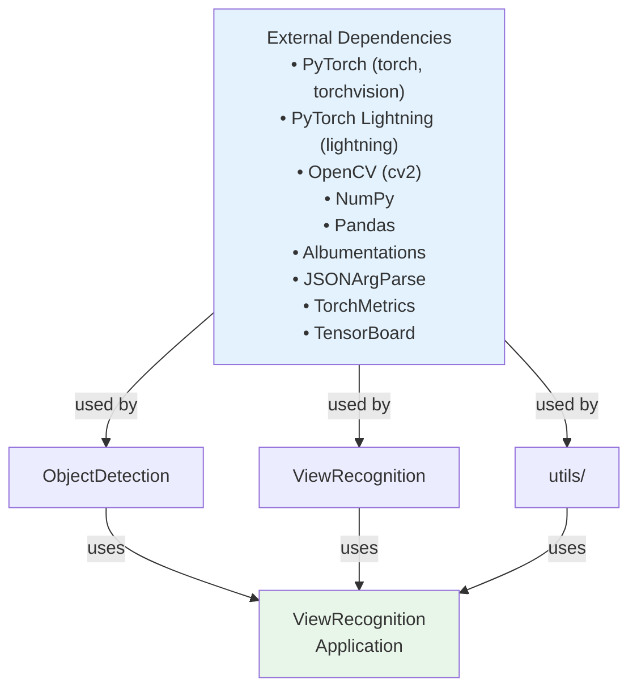

---

## Module Interconnections

### Import Dependencies

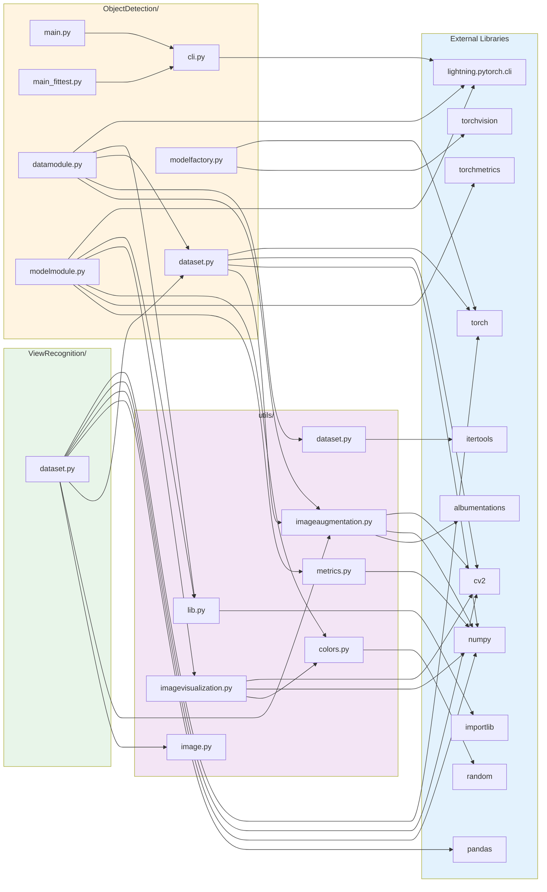

### Data Flow Between Modules

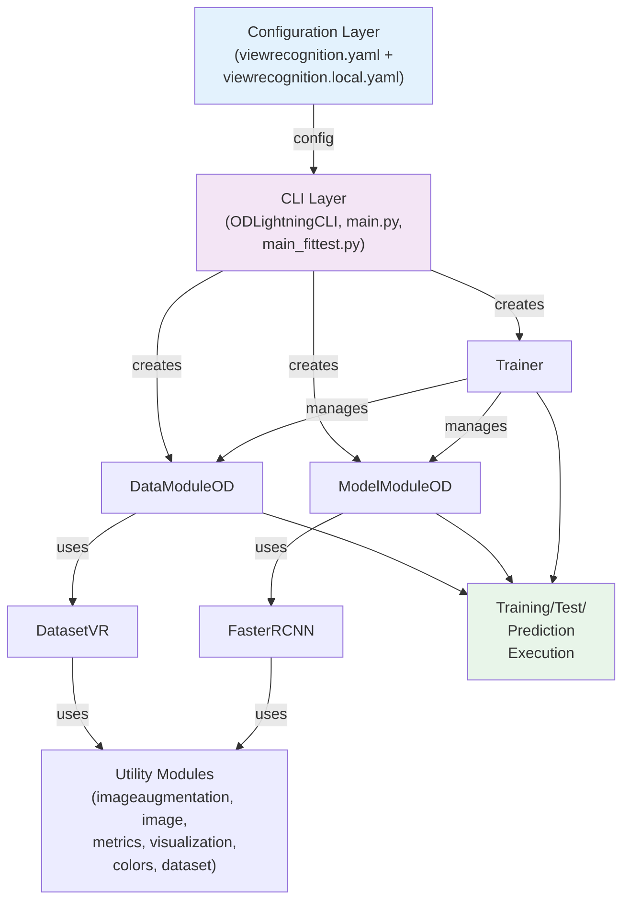

---

## Data Flow Diagrams

### Training Data Flow

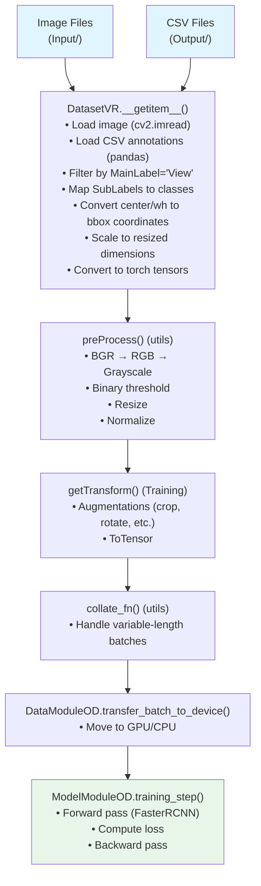

### Inference Data Flow

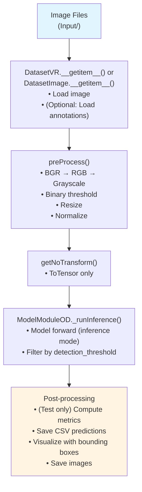

---

## Configuration Flow

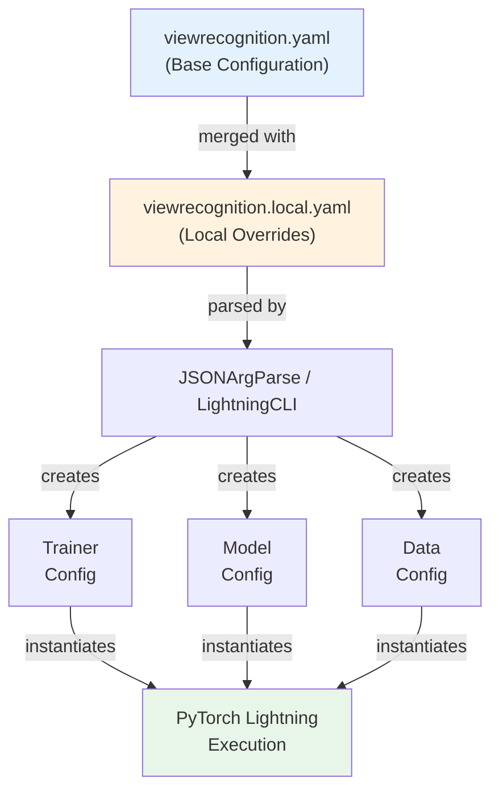

---

## Summary

This document provides comprehensive diagrams and design documentation for the Image-to-Physical Object Detection project. The system follows a modular, extensible architecture based on PyTorch Lightning, making it easy to:

1. **Add new object detection tasks** by creating new dataset classes
2. **Switch models** via configuration without code changes
3. **Extend functionality** through the utility modules
4. **Configure workflows** through YAML files

The design separates concerns:
- **ObjectDetection/**: Reusable framework components
- **ViewRecognition/**: Application-specific implementation
- **utils/**: Shared utilities

This separation allows the framework to be reused for other object detection tasks while keeping application-specific code isolated.
