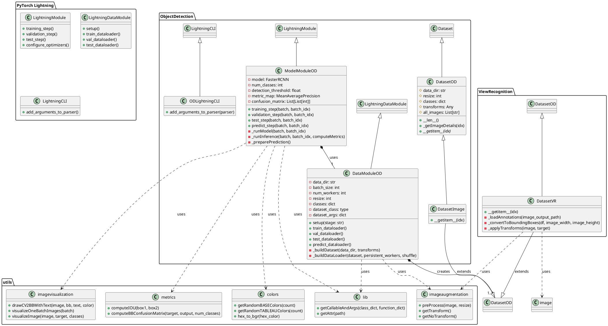
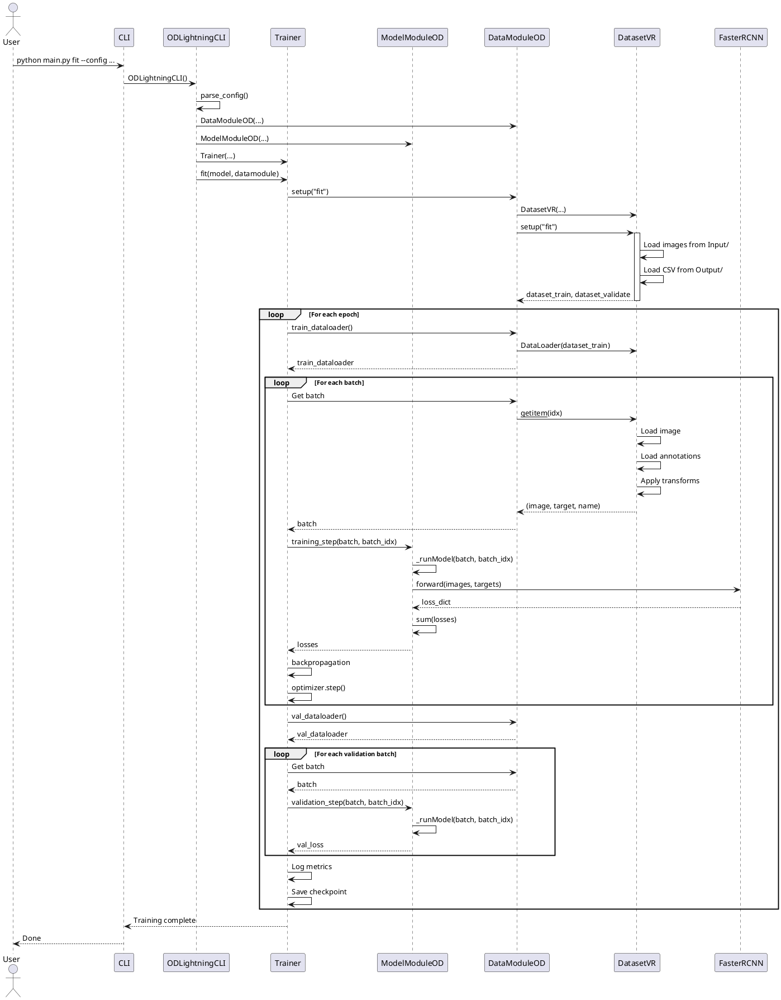
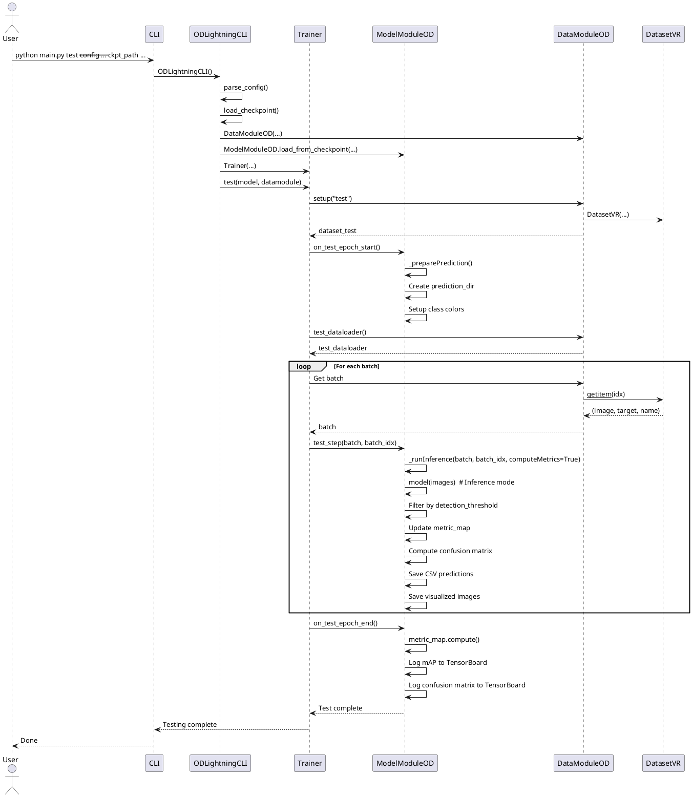
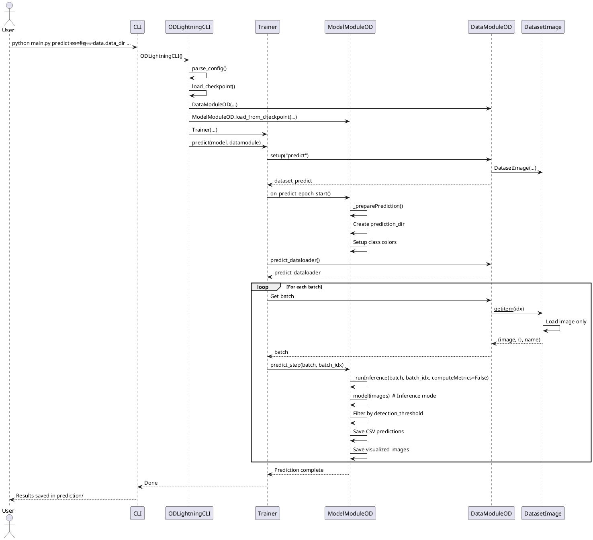

# UML Diagrams and Design Documentation

This document contains comprehensive UML diagrams, class diagrams, sequence diagrams, High-Level Design (HLD), Low-Level Design (LLD), and visual representations of the project structure and interconnections.

## Table of Contents

- [High-Level Design (HLD)](#high-level-design-hld)
- [Low-Level Design (LLD)](#low-level-design-lld)
- [Class Diagrams](#class-diagrams)
- [Sequence Diagrams](#sequence-diagrams)
- [Folder and File Structure](#folder-and-file-structure)
- [Module Interconnections](#module-interconnections)
- [Data Flow Diagrams](#data-flow-diagrams)

---

## High-Level Design (HLD)

### System Overview

```
┌─────────────────────────────────────────────────────────────────┐
│                    Image-to-Physical System                      │
│                      Object Detection Framework                  │
└─────────────────────────────────────────────────────────────────┘
                              │
                              │
        ┌─────────────────────┼─────────────────────┐
        │                     │                     │
        ▼                     ▼                     ▼
┌───────────────┐    ┌───────────────┐    ┌───────────────┐
│ Configuration │    │   Training    │    │   Inference   │
│   Management  │    │   Pipeline    │    │   Pipeline    │
└───────────────┘    └───────────────┘    └───────────────┘
        │                     │                     │
        │                     ▼                     ▼
        │            ┌─────────────────┐   ┌─────────────────┐
        │            │  PyTorch        │   │  Model          │
        │            │  Lightning      │   │  Inference      │
        │            │  Framework      │   │  Engine         │
        │            └─────────────────┘   └─────────────────┘
        │                     │                     │
        ▼                     ▼                     ▼
┌──────────────────────────────────────────────────────────────┐
│              Core Components Layer                            │
│  ┌──────────────┐  ┌──────────────┐  ┌──────────────┐      │
│  │   Data       │  │    Model     │  │    Utils     │      │
│  │  Module      │  │   Module     │  │   Modules    │      │
│  └──────────────┘  └──────────────┘  └──────────────┘      │
└──────────────────────────────────────────────────────────────┘
                              │
                              ▼
┌──────────────────────────────────────────────────────────────┐
│              Application Layer (View Recognition)             │
│  ┌──────────────┐  ┌──────────────┐  ┌──────────────┐      │
│  │   DatasetVR  │  │   Config     │  │   Notebook   │      │
│  │   Dataset    │  │   Files      │  │   Interface  │      │
│  └──────────────┘  └──────────────┘  └──────────────┘      │
└──────────────────────────────────────────────────────────────┘
```

### Component Architecture

```
┌──────────────────────────────────────────────────────────────┐
│                       User Interface Layer                    │
├──────────────────────────────────────────────────────────────┤
│  • CLI (Command Line Interface)                              │
│  • Jupyter Notebook                                          │
│  • Configuration Files (YAML)                                │
└──────────────────────────────────────────────────────────────┘
                              │
                              ▼
┌──────────────────────────────────────────────────────────────┐
│                   Application Orchestration Layer             │
├──────────────────────────────────────────────────────────────┤
│  • ODLightningCLI (Custom CLI)                               │
│  • Main Entry Points (main.py, main_fittest.py)              │
│  • Configuration Parser (JSONArgParse)                       │
└──────────────────────────────────────────────────────────────┘
                              │
        ┌─────────────────────┼─────────────────────┐
        ▼                     ▼                     ▼
┌───────────────┐    ┌───────────────┐    ┌───────────────┐
│   Training    │    │    Testing    │    │   Prediction  │
│   Workflow    │    │   Workflow    │    │   Workflow    │
└───────────────┘    └───────────────┘    └───────────────┘
        │                     │                     │
        └─────────────────────┼─────────────────────┘
                              ▼
┌──────────────────────────────────────────────────────────────┐
│                  PyTorch Lightning Framework                  │
├──────────────────────────────────────────────────────────────┤
│  • Trainer (Training Loop Management)                        │
│  • LightningModule (Model Logic)                             │
│  • LightningDataModule (Data Management)                     │
│  • Callbacks (Checkpointing, Logging)                        │
│  • Loggers (TensorBoard)                                     │
└──────────────────────────────────────────────────────────────┘
                              │
        ┌─────────────────────┼─────────────────────┐
        ▼                     ▼                     ▼
┌───────────────┐    ┌───────────────┐    ┌───────────────┐
│   PyTorch     │    │   TorchVision │    │   Utilities   │
│   Framework   │    │   Models      │    │   (OpenCV,    │
│               │    │   (FasterRCNN)│    │    NumPy, etc)│
└───────────────┘    └───────────────┘    └───────────────┘
```

### Data Flow Architecture

```
┌──────────────┐
│  Raw Images  │
│  + CSV Annot.│
└──────┬───────┘
       │
       ▼
┌──────────────────────────────────────────────────┐
│            Data Loading Layer                     │
│  ┌──────────────┐      ┌──────────────┐         │
│  │ DatasetVR    │─────▶│ DataModuleOD │         │
│  │ (View        │      │ (Data        │         │
│  │ Recognition) │      │ Management)  │         │
│  └──────────────┘      └──────────────┘         │
└──────────────────────────────────────────────────┘
       │
       ▼
┌──────────────────────────────────────────────────┐
│         Preprocessing & Augmentation              │
│  • Image Preprocessing (Grayscale, Binary)       │
│  • Data Augmentation (Training only)             │
│  • Resize & Normalize                            │
└──────────────────────────────────────────────────┘
       │
       ▼
┌──────────────────────────────────────────────────┐
│            Model Processing Layer                 │
│  ┌──────────────┐      ┌──────────────┐         │
│  │ ModelModuleOD│─────▶│ Faster R-CNN │         │
│  │ (Lightning   │      │ + ResNet50   │         │
│  │  Module)     │      │   FPN        │         │
│  └──────────────┘      └──────────────┘         │
└──────────────────────────────────────────────────┘
       │
       ▼
┌──────────────────────────────────────────────────┐
│         Post-Processing & Evaluation             │
│  • Filter by Detection Threshold                 │
│  • Compute Metrics (mAP, Confusion Matrix)       │
│  • Generate Visualizations                       │
│  • Export Results (CSV, Images)                  │
└──────────────────────────────────────────────────┘
```

---

## Low-Level Design (LLD)

### Module Dependencies

```
ObjectDetection/
├── cli.py
│   └── depends on: lightning.pytorch.cli
│
├── main.py
│   └── depends on: cli.py
│
├── main_fittest.py
│   └── depends on: cli.py
│
├── datamodule.py
│   ├── depends on: lightning, utils.lib, ObjectDetection.dataset, utils.dataset, utils.imageaugmentation
│   └── exports: DataModuleOD
│
├── dataset.py
│   ├── depends on: torch.utils.data, cv2, numpy, utils.imageaugmentation
│   └── exports: DatasetOD, DatasetImage
│
├── modelmodule.py
│   ├── depends on: lightning, utils.lib, utils.imagevisualization, utils.colors, torchmetrics, utils.metrics
│   └── exports: ModelModuleOD
│
└── modelfactory.py
    └── depends on: torch, torchvision
    └── exports: getModelfasterrcnn_resnet50_fpn

ViewRecognition/
├── dataset.py
│   ├── depends on: ObjectDetection.dataset, utils.imageaugmentation, utils.image
│   └── exports: DatasetVR
│
└── config/
    ├── viewrecognition.yaml
    └── viewrecognition.local.yaml

utils/
├── colors.py
│   └── exports: getRandomBASEColors, getRandomTABLEAUColors, hex_to_bgr
│
├── dataset.py
│   └── exports: collate_fn
│
├── image.py
│   └── exports: convertToBoundingBox
│
├── imageaugmentation.py
│   └── exports: preProcess, getTransform, getNoTransform
│
├── imagevisualization.py
│   └── exports: drawCV2BBWithText, visualizeOneBatchImages, visualizeImage
│
├── lib.py
│   └── exports: getCallableAndArgs, getAttr
│
└── metrics.py
    └── exports: computeIOU, computeBBConfusionMatrix
```

---

## Class Diagrams

### Core Classes Diagram



### Detailed ModelModuleOD Class

```
┌─────────────────────────────────────────────────────────────┐
│                    ModelModuleOD                             │
├─────────────────────────────────────────────────────────────┤
│ - model: FasterRCNN                                         │
│ - num_classes: int                                          │
│ - detection_threshold: float                                │
│ - visualize_training_images: bool                           │
│ - save_predicted_images: bool                               │
│ - confusion_matrix: List[List[int]]                         │
│ - metric_map: MeanAveragePrecision                          │
│ - prediction_dir: str                                       │
│ - classcolors: dict                                         │
├─────────────────────────────────────────────────────────────┤
│ + __init__(num_classes, detection_threshold,                │
│            visualize_training_images,                        │
│            save_predicted_images,                            │
│            torch_model, torch_model_factory)                 │
│                                                              │
│ + training_step(batch, batch_idx) -> losses                 │
│ + validation_step(batch, batch_idx)                         │
│ + test_step(batch, batch_idx)                               │
│ + predict_step(batch, batch_idx)                            │
│                                                              │
│ + on_train_batch_start(batch, batch_idx)                    │
│ + on_test_epoch_start()                                     │
│ + on_test_epoch_end()                                       │
│ + on_predict_epoch_start()                                  │
│                                                              │
│ - _runModel(batch, batch_idx) -> (losses, loss_value)       │
│ - _runInference(batch, batch_idx, computeMetrics)           │
│ - _preparePrediction()                                      │
└─────────────────────────────────────────────────────────────┘
```

### Detailed DataModuleOD Class

```
┌─────────────────────────────────────────────────────────────┐
│                    DataModuleOD                              │
├─────────────────────────────────────────────────────────────┤
│ - data_dir: str                                             │
│ - batch_size: int                                           │
│ - num_workers: int                                          │
│ - resize: int                                               │
│ - classes: dict                                             │
│ - dataset_class: type                                       │
│ - dataset_args: dict                                        │
│ - dataset_train: DatasetOD                                  │
│ - dataset_validate: DatasetOD                               │
│ - dataset_test: DatasetOD                                   │
│ - dataset_predict: DatasetImage                             │
├─────────────────────────────────────────────────────────────┤
│ + __init__(data_dir, batch_size, num_workers,               │
│            resize, classes, dataset, dataset_factory)        │
│                                                              │
│ + setup(stage: str)                                         │
│ + train_dataloader() -> DataLoader                          │
│ + val_dataloader() -> DataLoader                            │
│ + test_dataloader() -> DataLoader                           │
│ + predict_dataloader() -> DataLoader                        │
│ + transfer_batch_to_device(batch, device, dataloader_idx)   │
│                                                              │
│ - _buildDataset(data_dir, transforms) -> DatasetOD          │
│ - _buildDataLoader(dataset, persistent_workers, shuffle)    │
│     -> DataLoader                                            │
└─────────────────────────────────────────────────────────────┘
```

### Dataset Class Hierarchy

```
┌─────────────────────────────────────────┐
│          torch.utils.data.Dataset       │
└────────────────────┬────────────────────┘
                     │
                     │ extends
                     │
┌────────────────────▼────────────────────┐
│            DatasetOD                    │
│ (Abstract Base Class)                   │
├─────────────────────────────────────────┤
│ # data_dir: str                         │
│ # resize: int                           │
│ # classes: dict                         │
│ # transforms: Any                       │
│ # all_images: List[str]                 │
├─────────────────────────────────────────┤
│ + __len__() -> int                      │
│ + _getImageDetails(idx) -> tuple        │
│ + __getitem__(idx) {abstract}           │
└────────────────────┬────────────────────┘
                     │
        ┌────────────┼────────────┐
        │            │            │
        │ extends    │ extends    │
        │            │            │
┌───────▼──────┐ ┌──▼──────────┐ │
│  DatasetVR   │ │ DatasetImage│ │
│ (View        │ │ (Prediction │ │
│ Recognition) │ │  Only)      │ │
├──────────────┤ ├─────────────┤ │
│ + __getitem__│ │ + __getitem__│ │
│   (idx)      │ │   (idx)      │ │
│              │ │              │ │
│ - Load CSV   │ │ - Load image │ │
│ - Filter     │ │ - Preprocess │ │
│   labels     │ │ - No targets │ │
│ - Convert to │ │              │ │
│   bboxes     │ │              │ │
│ - Apply      │ │              │ │
│   transforms │ │              │ │
└──────────────┘ └──────────────┘ │
                                  │
                    (Can add more)│
```

---

## Sequence Diagrams

### Training Sequence Diagram



### Testing Sequence Diagram



### Prediction Sequence Diagram



---

## Folder and File Structure

### Complete Project Structure

```
image-to-physical/
│
├── 📁 ObjectDetection/                    # Core Object Detection Framework
│   │
│   ├── 📄 cli.py                          # Custom Lightning CLI (ODLightningCLI)
│   │   └── Extends: LightningCLI
│   │   └── Exports: ODLightningCLI
│   │
│   ├── 📄 main.py                         # Main CLI Entry Point
│   │   └── Commands: fit, test, predict
│   │   └── Uses: ODLightningCLI
│   │
│   ├── 📄 main_fittest.py                 # Fit + Test Entry Point
│   │   └── Workflow: fit → test
│   │   └── Uses: ODLightningCLI
│   │
│   ├── 📄 datamodule.py                   # Data Module (DataModuleOD)
│   │   └── Extends: LightningDataModule
│   │   └── Exports: DataModuleOD
│   │   └── Imports: utils.lib, ObjectDetection.dataset, utils.*
│   │
│   ├── 📄 dataset.py                      # Base Dataset Classes
│   │   └── Classes: DatasetOD (abstract), DatasetImage
│   │   └── Extends: torch.utils.data.Dataset
│   │   └── Imports: cv2, numpy, utils.imageaugmentation
│   │
│   ├── 📄 modelmodule.py                  # Model Module (ModelModuleOD)
│   │   └── Extends: LightningModule
│   │   └── Exports: ModelModuleOD
│   │   └── Imports: utils.lib, utils.*, torchmetrics
│   │
│   └── 📄 modelfactory.py                 # Model Factory Functions
│       └── Functions: getModelfasterrcnn_resnet50_fpn
│       └── Imports: torch, torchvision
│
├── 📁 ViewRecognition/                    # View Recognition Application
│   │
│   ├── 📄 dataset.py                      # View Recognition Dataset
│   │   └── Class: DatasetVR
│   │   └── Extends: DatasetOD
│   │   └── Imports: ObjectDetection.dataset, utils.*
│   │
│   └── 📁 config/                         # Configuration Files
│       │
│       ├── 📄 viewrecognition.yaml        # Main Configuration
│       │   └── Sections: trainer, model, data, optimizer, lr_scheduler
│       │
│       └── 📄 viewrecognition.local.yaml  # Local Overrides (gitignored)
│           └── Overrides: trainer, data, model settings
│
├── 📁 utils/                              # Utility Modules
│   │
│   ├── 📄 colors.py                       # Color Utilities
│   │   └── Functions: getRandomBASEColors, getRandomTABLEAUColors, hex_to_bgr
│   │
│   ├── 📄 dataset.py                      # Dataset Utilities
│   │   └── Function: collate_fn (for variable-length batches)
│   │
│   ├── 📄 image.py                        # Image Processing
│   │   └── Function: convertToBoundingBox (center→corners conversion)
│   │
│   ├── 📄 imageaugmentation.py            # Image Augmentation
│   │   └── Functions: preProcess, getTransform, getNoTransform
│   │   └── Uses: albumentations, cv2
│   │
│   ├── 📄 imagevisualization.py           # Visualization
│   │   └── Functions: drawCV2BBWithText, visualizeOneBatchImages, visualizeImage
│   │   └── Uses: cv2, utils.colors
│   │
│   ├── 📄 lib.py                          # Configuration Utilities
│   │   └── Functions: getCallableAndArgs, getAttr
│   │   └── Uses: importlib
│   │
│   └── 📄 metrics.py                      # Evaluation Metrics
│       └── Functions: computeIOU, computeBBConfusionMatrix
│       └── Uses: numpy
│
├── 📄 ViewRecognition.ipynb               # Jupyter Notebook Interface
│   └── Uses: ObjectDetection.*, ViewRecognition.config
│
├── 📄 requirements.txt                    # Python Dependencies
│   └── Packages: torch, lightning, opencv-python, albumentations, etc.
│
├── 📄 README.md                           # Project Documentation
│
└── 📄 UML_DIAGRAMS.md                     # This File
```

### Dependency Graph

```
┌─────────────────────────────────────────────────────────────────┐
│                         External Dependencies                    │
├─────────────────────────────────────────────────────────────────┤
│  • PyTorch (torch, torchvision)                                 │
│  • PyTorch Lightning (lightning)                                │
│  • OpenCV (cv2)                                                 │
│  • NumPy                                                         │
│  • Pandas                                                       │
│  • Albumentations                                               │
│  • JSONArgParse                                                 │
│  • TorchMetrics                                                 │
│  • TensorBoard                                                  │
└─────────────────────────────────────────────────────────────────┘
                              │
                              │ used by
                              │
        ┌─────────────────────┼─────────────────────┐
        │                     │                     │
        ▼                     ▼                     ▼
┌───────────────┐    ┌───────────────┐    ┌───────────────┐
│ ObjectDetection│   │ ViewRecognition│   │    utils/     │
└───────────────┘    └───────────────┘    └───────────────┘
        │                     │                     │
        │ uses                │ uses                │
        │                     │                     │
        └─────────────────────┼─────────────────────┘
                              │
                              ▼
                    ┌──────────────────┐
                    │  ViewRecognition │
                    │    Application   │
                    └──────────────────┘
```

---

## Module Interconnections

### Import Dependencies

```
ObjectDetection/
│
├── cli.py
│   └── imports: lightning.pytorch.cli.LightningCLI
│
├── main.py
│   └── imports: cli.ODLightningCLI
│
├── main_fittest.py
│   └── imports: cli.ODLightningCLI
│
├── datamodule.py
│   ├── imports: lightning, utils.lib
│   ├── imports: ObjectDetection.dataset (DatasetOD, DatasetImage)
│   ├── imports: utils.dataset (collate_fn)
│   └── imports: utils.imageaugmentation (getTransform, getNoTransform)
│
├── dataset.py
│   ├── imports: torch.utils.data.Dataset
│   ├── imports: cv2, numpy
│   └── imports: utils.imageaugmentation (preProcess)
│
├── modelmodule.py
│   ├── imports: lightning
│   ├── imports: utils.lib
│   ├── imports: utils.imagevisualization
│   ├── imports: utils.colors
│   ├── imports: torchmetrics.detection.mean_ap
│   └── imports: utils.metrics
│
└── modelfactory.py
    ├── imports: torch
    └── imports: torchvision.models.detection.*

ViewRecognition/
│
└── dataset.py
    ├── imports: torch, cv2, numpy, pandas
    ├── imports: ObjectDetection.dataset (DatasetOD, CSV_HEADERS)
    ├── imports: utils.imageaugmentation (preProcess)
    └── imports: utils.image (convertToBoundingBox)

utils/
│
├── colors.py
│   └── imports: random
│
├── dataset.py
│   └── imports: itertools
│
├── image.py
│   └── (no external imports)
│
├── imageaugmentation.py
│   ├── imports: cv2, numpy
│   └── imports: albumentations.*
│
├── imagevisualization.py
│   ├── imports: cv2, numpy
│   └── imports: utils.colors
│
├── lib.py
│   └── imports: importlib
│
└── metrics.py
    └── imports: numpy
```

### Data Flow Between Modules

```
┌──────────────────────────────────────────────────────────────┐
│                    Configuration Layer                        │
│  (viewrecognition.yaml + viewrecognition.local.yaml)         │
└──────────────────────┬───────────────────────────────────────┘
                       │
                       │ config
                       ▼
┌──────────────────────────────────────────────────────────────┐
│                    CLI Layer                                  │
│  (ODLightningCLI, main.py, main_fittest.py)                  │
└──────────────────────┬───────────────────────────────────────┘
                       │
         ┌─────────────┼─────────────┐
         │             │             │
    creates       creates       creates
         │             │             │
         ▼             ▼             ▼
┌──────────────┐ ┌──────────────┐ ┌──────────────┐
│ DataModuleOD │ │ModelModuleOD │ │   Trainer    │
└──────┬───────┘ └──────┬───────┘ └──────┬───────┘
       │                │                │
       │ uses           │ uses           │ manages
       │                │                │
       ▼                ▼                │
┌──────────────┐ ┌──────────────┐       │
│  DatasetVR   │ │ FasterRCNN   │       │
└──────┬───────┘ └──────────────┘       │
       │                                 │
       │ uses                            │
       ▼                                 │
┌───────────────────────────────────────┐│
│         Utility Modules                ││
│  (imageaugmentation, image, metrics,  ││
│   visualization, colors, dataset)      ││
└───────────────────────────────────────┘│
                                         │
                                         │
                       ┌─────────────────┘
                       │
                       ▼
              ┌─────────────────┐
              │  Training/Test/ │
              │   Prediction    │
              │    Execution    │
              └─────────────────┘
```

---

## Data Flow Diagrams

### Training Data Flow

```
┌──────────────┐
│ Image Files  │
│ (Input/)     │
└──────┬───────┘
       │
       ▼
┌──────────────┐
│  CSV Files   │
│ (Output/)    │
└──────┬───────┘
       │
       ▼
┌──────────────────────────────────────────┐
│         DatasetVR.__getitem__()          │
│  • Load image (cv2.imread)               │
│  • Load CSV annotations (pandas)         │
│  • Filter by MainLabel="View"            │
│  • Map SubLabels to classes              │
│  • Convert center/wh to bbox coordinates │
│  • Scale to resized dimensions           │
│  • Convert to torch tensors              │
└──────┬───────────────────────────────────┘
       │
       ▼
┌──────────────────────────────────────────┐
│      preProcess() (utils)                │
│  • BGR → RGB → Grayscale                 │
│  • Binary threshold                      │
│  • Resize                                │
│  • Normalize                             │
└──────┬───────────────────────────────────┘
       │
       ▼
┌──────────────────────────────────────────┐
│      getTransform() (Training)           │
│  • Augmentations (crop, rotate, etc.)    │
│  • ToTensor                              │
└──────┬───────────────────────────────────┘
       │
       ▼
┌──────────────────────────────────────────┐
│         collate_fn() (utils)             │
│  • Handle variable-length batches        │
└──────┬───────────────────────────────────┘
       │
       ▼
┌──────────────────────────────────────────┐
│      DataModuleOD.transfer_batch_to_     │
│      device()                            │
│  • Move to GPU/CPU                       │
└──────┬───────────────────────────────────┘
       │
       ▼
┌──────────────────────────────────────────┐
│      ModelModuleOD.training_step()       │
│  • Forward pass (FasterRCNN)             │
│  • Compute loss                          │
│  • Backward pass                         │
└──────────────────────────────────────────┘
```

### Inference Data Flow

```
┌──────────────┐
│ Image Files  │
│ (Input/)     │
└──────┬───────┘
       │
       ▼
┌──────────────────────────────────────────┐
│   DatasetVR.__getitem__() or             │
│   DatasetImage.__getitem__()             │
│  • Load image                            │
│  • (Optional: Load annotations)          │
└──────┬───────────────────────────────────┘
       │
       ▼
┌──────────────────────────────────────────┐
│      preProcess()                        │
│  • BGR → RGB → Grayscale                 │
│  • Binary threshold                      │
│  • Resize                                │
│  • Normalize                             │
└──────┬───────────────────────────────────┘
       │
       ▼
┌──────────────────────────────────────────┐
│      getNoTransform()                    │
│  • ToTensor only                         │
└──────┬───────────────────────────────────┘
       │
       ▼
┌──────────────────────────────────────────┐
│      ModelModuleOD._runInference()       │
│  • Model forward (inference mode)        │
│  • Filter by detection_threshold         │
└──────┬───────────────────────────────────┘
       │
       ▼
┌──────────────────────────────────────────┐
│      Post-processing                     │
│  • (Test only) Compute metrics           │
│  • Save CSV predictions                  │
│  • Visualize with bounding boxes         │
│  • Save images                           │
└──────────────────────────────────────────┘
```

---

## Configuration Flow

```
┌─────────────────────────────────────────┐
│  viewrecognition.yaml                   │
│  (Base Configuration)                   │
└──────────────┬──────────────────────────┘
               │
               │ merged with
               │
┌──────────────▼──────────────────────────┐
│  viewrecognition.local.yaml             │
│  (Local Overrides)                      │
└──────────────┬──────────────────────────┘
               │
               │ parsed by
               │
┌──────────────▼──────────────────────────┐
│  JSONArgParse / LightningCLI            │
└──────────────┬──────────────────────────┘
               │
               │ creates
               │
       ┌───────┼───────┐
       │       │       │
       ▼       ▼       ▼
┌──────────┐ ┌──────────┐ ┌──────────┐
│  Trainer │ │   Model  │ │   Data   │
│  Config  │ │  Config  │ │  Config  │
└──────────┘ └──────────┘ └──────────┘
       │       │       │
       │       │       │ instantiates
       │       │       │
       └───────┼───────┘
               │
               ▼
    ┌──────────────────────┐
    │  PyTorch Lightning   │
    │  Execution           │
    └──────────────────────┘
```

---

## Summary

This document provides comprehensive diagrams and design documentation for the Image-to-Physical Object Detection project. The system follows a modular, extensible architecture based on PyTorch Lightning, making it easy to:

1. **Add new object detection tasks** by creating new dataset classes
2. **Switch models** via configuration without code changes
3. **Extend functionality** through the utility modules
4. **Configure workflows** through YAML files

The design separates concerns:
- **ObjectDetection/**: Reusable framework components
- **ViewRecognition/**: Application-specific implementation
- **utils/**: Shared utilities

This separation allows the framework to be reused for other object detection tasks while keeping application-specific code isolated.
